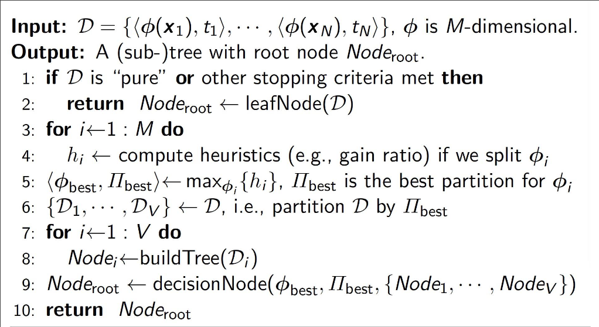

# Introduction to Decision Trees
Decision trees are hierarchical structures used for both classification and regression tasks. They partition the feature space along axes to produce decision regions.

Key Advantages:
- High efficiency (logarithmic tree operations)
- Non-linear decision boundaries
- High interpretability
- Readily convertible to decision rules

### Basic Tree Structure
- Root Node: Top node of the tree
- Decision Node: Internal node that splits into branches
- Terminal Node (Leaf): Final node containing the prediction
- Branch/Sub-tree: Part of the tree below a decision node

## Tree Pruning Methods
### Pre-pruning (Early Stopping)
- Stop growing when:
  - Minimum samples for split reached
  - Maximum depth reached
  - Minimum samples in leaf reached
  - Maximum leaf nodes reached

Advantages:
- Fast
- Prevents overfitting early

Disadvantages:
- Risk of underfitting
- May stop too early

### Post-pruning
- Grow full tree
- Remove branches that don't improve performance
- Use validation set to evaluate

Advantages:
- Better optimization
- More reliable

Disadvantages:
- Computationally intensive
- Requires validation set

# Generic Decision Tree Construction

This is essentially a recursive algorithm that builds a decision tree from data. Here's what it does step by step:

1. **Input**: Takes a dataset D with feature vectors (φ(x)) and their corresponding labels (t)
2. **Base Case** (Lines 1-2):
    - If the data is "pure" (meaning all samples belong to the same class) or meets other stopping conditions
    - Then create a leaf node and return it
3. **Feature Selection** (Lines 3-5):
    - For each feature dimension (1 to M)
    - Calculate how good it would be to split the data on this feature (using metrics like information gain ratio)
    - Pick the best feature (φ_best) and its best splitting criteria (Π_best)
4. **Data Splitting** (Line 6):
    - Using the best feature and split point chosen above
    - Divide the data into V subsets (D₁ to Dᵥ)
5. **Recursive Tree Building** (Lines 7-8):
    - For each subset of data
    - Recursively call the same tree-building process
    - This creates subtrees for each partition
6. **Node Creation** (Line 9):
    - Create a decision node that contains:
    - The best feature to split on
    - The splitting criteria
    - Links to all the subtrees created in step 5

Think of it like playing a game of "20 Questions" - at each step, the algorithm tries to find the most informative question (feature) to ask that will help it best separate the data into distinct groups. It keeps doing this recursively until it reaches groups that are "pure enough" to make a decision.