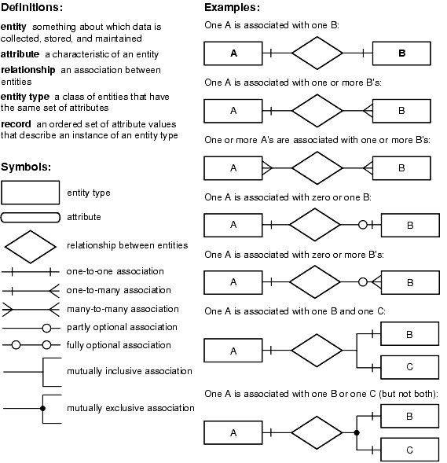

# ERD
The ERD is a graphical notation that **visually depicts the entities, their attributes, and the relationships between them.** Entities represent real-world objects, while relationships depict how these entities are related to each other. 

**Conceptual models generally do not include primary keys or foreign keys**, as these are implementation-specific and belong to the logical or physical modelling phases. Once the conceptual database model is created and validated with stakeholders, it serves as a foundation for further refinement in the logical and physical database modelling phases.
