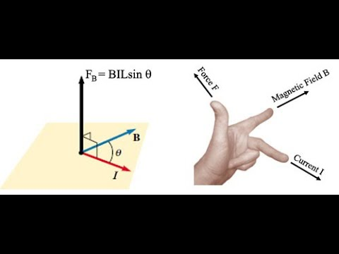

Lorentz force equations describe the force acting on a charged particle/conductor. We can use Fleming's Left Hand Rule to determine the direction.

$$F = iLB$$

**We can use our ole reliable:**
$$BiL \sin\theta$$
When our magnetic field and the direction of current aren't perpendicular, but have the angle $\theta$ between them.

We can also do this for charged objects within a magnetic field.
$$F = QE$$
Where: 
$F$ = Force on charge (N)
$Q$ = Charge on object (Coulombs)
$B$ = Magnetic Field Strength (Tesla)

If our charge is in motion:
$$F = QvB$$
Where:
$F$ = Force (N)
$v$ = Velocity (m/s)
$B$ = Magnetic Field Strength (Tesla)

When in a combination of magnetic and electric field:
$$F = Q(E+vB)$$
$F$ = Force (N)
$v$ = Velocity (m/s)
$B$ = Magnetic Field Strength (Tesla)
$E$ = Electric Field Strength (Volts/meter)
