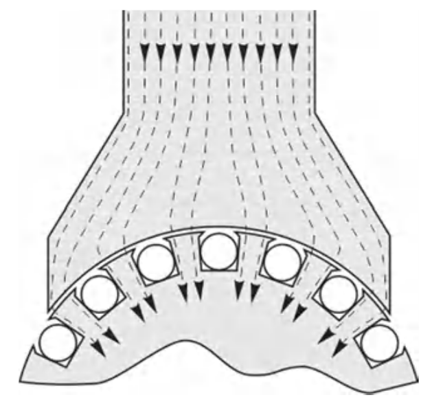
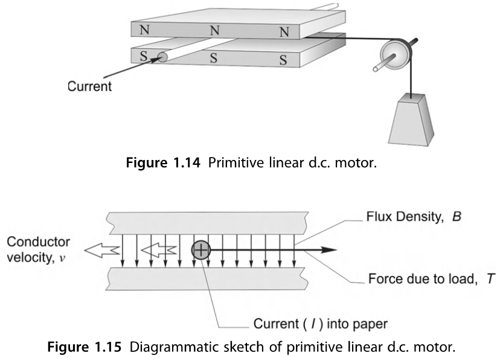
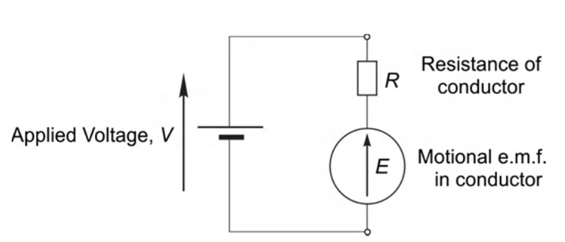
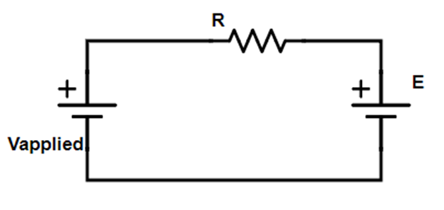

#MTRN/2060 #Circuits 
[motor and drive questions](Attachments/motor%20and%20drive%20questions.docx)
[generic linear solenoid 1](Attachments/generic%20linear%20solenoid%201.pdf)

•The above is clearly a good magnetic circuit, but without conductors on the rotors we will not get torque.

•Current carrying conductors around the rotor generate BiL force for each wire.

$$Torque = Force*RotorRadius$$
## Slotting

•Conductors lying on the rotor increase the air gap, increasing reluctance and reducing the flux.

•They also have to be secured to the rotor to transmit their force.

•Slotting solves both of these problems.  While still allowing the conductors to cut the field lines (though it doesn’t look like it).

•Now however we must balance current density (limited to 2-8 A/mm2) and flux density (limited to ~1.5 T). We want as much copper as possible and we want as much iron as possible.

# Permanent Magnet Direct Current (PMDC)

•electric current is directed through brushes and a commutator to coils on the rotor.

•The rotor is comprised of magnetic steel with copper windings

•A small air-gap exists between the rotor and the permanent magnets of the stator. A steel casing forms a yoke to complete the magnetic circuit.

# Towards a Useful Mathematical Model: Consider an Elementary Motor

Conductor has resistance R, carries a current I and moves with velocity v. The string is connected to a mass.

At v=0, what are the pulling force, current, electrical input power, and mechanical output power?

•Force from gravity = mg

•Force from magnetic field = BiL

•At v=0, these forces must be equal: $mg=BiL$

$i=mg/BL$

•The electrical input power is 
$P_E=i^2 R=Vi$

•The mechanical output power is 0.

At v=constant, what are the pulling force, current, electrical input power, and mechanical output power?

•At v=constant, these forces must still be equal: mg=BiL

$i=mg/BL$

•But now work is being done. The electrical input power is $P_E=i^2 R$+mechanical output power

•The mechanical output power = $mgv$

$$Vi=i^2 R+mgv$$

$$Vi=i^2 R+BiLv$$

$$V=iR+vBL$$

•This vBL term is the “back EMF” the is present whenever a motor spins.

•We can create a simple equivalent circuit for the DC motor (ignores inductance)

•This equivalent circuit is very useful for both understanding the DC motor and calculating operating parameters

## Equivalent Circuit

•DC motors have a simple equivalent circuit, includes back emf: E.

•If E is less than V, current will be positive and power will flow from electrical to mechanical form.

E is proportional to speed, related by the electrical constant KE:

$$E = K_E w$$

Then:   $V_{applied} = RI + K_Ew$

If we spin the motor fast enough such that E is larger than V, then the current will reverse and mechanical power will be converted to electrical power. Called generating.

## Mechanical Output Power

•Power supplied by V is conserved.

•It goes to two places:

$P_{in}=P_{out}$

$Vi=i^2 R+Ei$

$P_{in} = Heat_{out}+P_{mech}$

$P_{mech}=Ei$

$Torque×speed=P_{mech}=Ei$

$τ×ω=Ei$

$Torque * speed = back EMF * current$ (only true if using correct units: Nm times rad/s)

Torque is proportional to current

Back EMF is proportional to speed

# The Ideal PM DC Model

•The Back EMF (E) is proportional to speed (electrical constant)

–KE = back EMF divided by speed

–If we ignore friction then applied voltage divided by no load speed

•The no load speed is the speed that the motor spins, when the back EMF equals the applied voltage.

•The no-load speed is proportional to voltage.

•No current will flow at no-load speed

•Torque is proportional to current (motor constant or torque constant)

–KT = Stall torque divided by stall current at any applied voltage

•At stall, the back EMF is 0. Current is limited only by the terminal resistance (resistance of the copper windings).

# PM DC Motor Torque Speed Curve

# Example Questions
#Examples  
Using the example data sheet given a few slides back for a permanent magnet DC motor.

a) What is the stall torque in Nm?

b) What is the stall current?

c) What is the no load speed in Hz and rad/s?

d) Determine the current, back EMF, and torque at half the no load speed?

e) Estimate the efficiency at this speed.

f) What is the torque constant KT and electrical constant KE? Be sure to give appropriate units. KT [Nm/A], KE [Vs/rad]