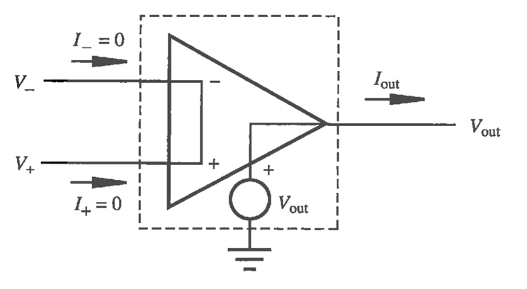
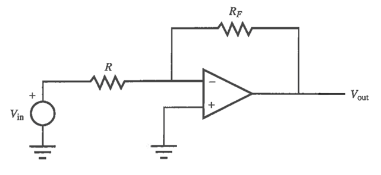

#MTRN/2060 #Circuits 

**Stress (s)**: The instantaneous load applied to a specimen divided by its cross sectional area before any deformation. SI unit (MPa).

$σ = F/A$

**Strain (e)**: The change in gauge length of a specimen (in the direction of applied stress divided by its original gauge length.

$ε = ΔL/L_{original}$

**Young's Modulus**: Modulus of elasticity, the slope of the stress-strain graph.

$E(GPa) = Stress/Strain$

**Poisson's Ratio**: Under Tensile stress, a material may contract in the perpendicular direction. The ratio of length change in lateral to axial directions or ratio of lateral to axial strain is Poisson’s Ratio.

$v=-ε_{lateral}/ε_{axial}$

# Elastic VS Plastic Deformation:

## Strain Gauges and Gauge Factor:

Gauge Factor relates resistance to strain in order to determine force applied to the strain gauge given a known area.

$ϵ_{axial}=(∆R∕R)/F$

Where:
R = Resistance (Ohms)
F = Gauge Factor

# Strain Gauge Circuits:
Wheatstone bridge:

R2 and R3 are high precision resistors of equal value.
R4 is high precision pot. Adjust pot until VA = VB

Above is a simple strain gauge, which relates force to resistance.

# Load Cells:
•Calibrated strain gauges bonded to a deformable material.
•Use Hooke’s Law s=Ee to convert strain to stress to force. E is modulus of elasticity
•Used in scales and test equipment such as the one you will use in lab.

# Operational Amplifiers - Op Amps:

•We use Op-Amps for analog signal processing, the first step before A to D conversion

•If you tried to use the A2D converter on the Arduino to measure Vout your scale would have very poor resolution.

•Mostly for acquiring signals that may be
	•too small,
	•too noisy
	•have an offset or
	•not be in the right format

•We will only consider the ideal Op-Amp, which is not the same as the real Op-Amp

## The Ideal Op Amp

1. Infinite input impedance: I+ = I- = 0
2. Infinite gain Vout = Gain(V+ - V-), therefore V+ = V- in negative feedback
3. Zero output impedance

# Inverting Amp: 
#Video 
[https://youtu.be/vjY4ikMxwGw](https://youtu.be/vjY4ikMxwGw)

# Non Inverting Amp:
#Video 
[https://youtu.be/gjfCGhaMttc](https://youtu.be/gjfCGhaMttc)

# Summer Amp:

Superposition Principle: For a linear system, we can analyze the inputs separately and sum their results

# Difference Amp:

When R1=R2=R,

$V_{out}=Rf/R (V2-V1)$

This works alright for sources (V1 & V2) with low output impedance. But for sources that cannot supply much current we use an instrumentation amplifier. It uses 3 op amps and has very high input impedance.

**Intrumentation Amplifier: INA125P**:
•A standard difference amplifier does not have a high input impedance.

•An instrumentation amplifier is a fancy difference amplifier.

•An instrumentation amplifier is normally a monolithic IC containing resistors and op-amps. It has

•very high input impedance

•Large common mode rejection ratio (CMMR) (ratio of average gain to difference average gain. zero in theory).

•Consistent bandwidth over a large range of gains.

•Gain is typically set by an external resistor.

•Getting a low CMRR is achieved by making the entire device on one chip and laser-trimming resistors to balance the gain of the + and – channels.

•See INA125P example data sheet for gain equation, output range, CMRR, bandwidth.

•See two examples of hacking a kitchen scale: pdf and [http://forum.arduino.cc/index.php/topic,192016.0.html](http://forum.arduino.cc/index.php/topic,192016.0.html)