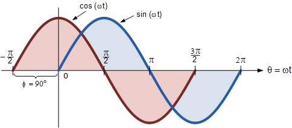

# Prereq and Basics

## Transistor Equivalent Circuit

## Simple Voltage Amplifier


## Thevenin's Theorem
"Any combination of voltage sources and resistors with two terminals can be replaced by a single voltage source and a single series resistor."
We can find this equivalent by:
1. Calculate the **open circuit voltage** and the **short-circuit current** of Circuit A.
2. Then calculate Thevenin resistance as: $R_{t}=\frac{v_{oc}}{i_{sc}}$
(Can be done with $R_{t}$ and $v_{oc}$ only

## Amplifiers
Signal gain can be achieved and expressed through voltage, current, or power.

Gain is a ratio, expressed as dimensionless, or V/V, A/A etc. Engineers often express gain logarithmically.


# Diodes
- Fabricated using a semiconductor with a P-N Junction
- Applications:
	- Power conversion
	- Over voltage protection
	- Detectors
	- Signal Generation

## Shockley Equation

*Shockley Equation (Forward bias)*
$$i_{D} = I_{s}(e^{v_{D}/nV_{r}}-1)$$
$$i_{D} = I_{s}[\exp{\frac{v_{D}}{nV_{T}}}-1]$$

**Where:**
- $I_{s} =$ Saturation current. Its value depends on the area of the diode and the temp. Doubling for each $5\degree$ increase for silicon diodes. $~10^{-14}$ A at 300K
- $n =$ Emission coefficient (ideality factor) $1 < n < 2$
- $V_{T} =$ Thermal voltage $V_{T =}kT/q$ 
	- Temperature in K = 273 + Temp in C
- $k = 1.38*10^{-23}$ Joules/Kelvin (**Boltzmann's Constant**)
- $q = 1.60 * 10^{-19}$ Coulomb (Charge of an electron)

There is also an approximate Shockley (for forward bias more than several tenths of a volt)
$$i_{D} \approx I_{s}\exp({\frac{v_{D}}{nV_{T}}})$$

## Constant Voltage Drop Model
- Only accounts for the forward turn on voltage
- Does not account for the slope or reverse breakdown.

For silicon diodes, typical $V_{f} =~ 0.7V$


## Linear Model (Not Accurate)
We can also model our diode using a simple linear equation. Although this is not a highly accurate model of a diode.

From this we derive:
$$i = \frac{1}{R_{a}}(v-V_{a})+ \frac{-V_{a}}{R_a}$$

We can improve this using piecewise functions to generalize non-linearity

*This is our graphical model. Good for load-line analysis*


## Analysis

### Assumed States
*In a circuit with a number of diodes n*
- Assume a state for each diode (ON/OFF)(Closed/Open)
- n diodes will require $2^{n}$ possible combinations
- **Calculate currents of ON diodes and voltages of OFF diodes**
- Check to see of calculations are consistent with assumptions
- If yes, assumption works. *If no, return to step 1 and make a new assumption*.

### Load Line Analysis
There's no straightforward way to solve the Shockley Equation with Kirchhoff's Voltage Law ($V_{SS} = Ri_{D}+v_{D}$)
We use load-line analysis graphically. Since $v_{D}$ is upside down here, what this means is that when there is no reverse bias, $i_{D} = \frac{V_{ss}}{R}$. When full reverse bias there is no current.
$i_{D} =\frac{V_{SS}-v_{D}}{R}$

$V_{SS}= 2V$
$R = 1k\ohm$ 

*We also need these to find the operating point:*
$V_{DQ} \approx 0.7V$ (constant drop)
$I_{DQ} \approx 1.3mA$

#### Load Line Analysis of Complex Circuits


### Small Signal Analysis (AC Signals)
- We applied *DC voltages (or currents) to the diodes and found the operating points (Q point)*
- Q stands for **quiescent** i.e. quiet or no-signal point

*If the Q point is known (using the nonlinear diode characteristic), the linear AC analysis method can be applied to find the response to small **(AC) signals.**

$$i_{D}(t) = I_{DQ}+i_{d}(t)$$
$$i_{d}(t) = I_{d}\cos(2\pi ft - 90\degree)$$


## Zener Diode
Zener diodes are designed to work at the reverse breakdown region. These diodes use this as expected behaviour.

*Commonly used for voltage regulator circuits - constant output from variable supply.*
5V change in the supply voltage results in only a 0.5V change the regulated output voltage.

## Rectifiers and Regulation

### Half Wave

*We can use the 0.7V drop model or ideal diode model without losing much accuracy because voltage levels >> 0.7V*
We can add a capacitor to smooth the output

$$C \approx \frac{I_L T}{V_{r}}$$
**Where:**
$I_{L} =$ Average load current
$T =$ Period of AC voltage
$V_{r} =$ Ripple voltage

*Chose diode to withstand Peak Inverse Voltage*
$PIV \approx 2V_{m}$
PIV needs to be less than the breakdown voltage of the diode.

# BJTs

The Arrow shows the current of the controlling pn-Junction
- Arrow from Emitter = PNP
- Arrow TO Emitter = NPN

## Modes of Operation

*Operating mode depends on DC biasing or large signal voltages and currents:*
- **Active** mode - Used for AC amplification
- **Cutoff** and *saturation* modes - used for switching
- BJT is not symmetrical - inverse region is not normally used.

### Active Region

Using Kirchhoff:
$$i_{E}= i_{C}+i_{B}$$

We can define:
$$i_{C}=\beta i_{B}$$
$$i_{C}=\alpha i_{E}$$

Which Implies:
$$\beta i_{B} = \alpha i_{E}$$

$$\alpha = \frac{\beta}{\beta+1}$$
Where:
$\beta$ = Factor of proportionality
$\alpha = \frac{i_{C}}{i_{E}}=$ Emitter injection efficiency

Typical values of these include:
$$\beta = 100$$
$$\alpha = 0.9 \leftrightarrow 0.99$$

*Some derivation I guess:*
$$i_{E}= (\frac{I_{s}}{\alpha})(e^{\frac{v_{BE}}{V_{T}}}-1)\approx (\frac{I_{s}}{\alpha})e^{\frac{v_{BE}}{V_{T}}}$$
$$i_{B}\approx (\frac{I_{s}}{\beta})e^{v_{BE}/V_{T}}$$
$$i_{C}\approx I_{s}e^{v_{BE}/V_T}$$
```ad-attention
title: NOTE
Base-emitter voltage controls the collector current
```


*Emitter current is equal to the total current:*
$$i_{E}=i_{B} + i_{C}=\frac{i_{C}}{\alpha}$$

Using [Kirchhoff's Laws](../../../Distilled%20Notes/Kirchhoff's%20Laws.md) and our diode equation:
$$i_{C} = I_{s}e^{v_{BE}/V_T}$$
Where:
$I_{s} =$ Constant (Saturation Current)
$V_{T}=$ Constant (Thermal Voltage)

We can determine:
$$i_{B}= \frac{i_{C}}{\beta}=\frac{I_{s}}{\beta}e^{v_{BE}/V_T}$$
*Base current is much smaller that collector current*

Emitter current is the total current:
$$i_{E}=i_{B}+i_{C}= \frac{i_C}{\alpha}$$


### Saturation Region


$i_{C} = I_{s}e^{\frac{v_{BE}}{V_{T}}}-I_{sc}e^{v_{BC}/V_{T}}$
											$\beta_{\text{forced}} = \frac{i_{C}}{i_{B}}$ ( at saturation) <= $\beta$
$i_{B} = \frac{I_{s}}{\beta} e^{\frac{v_{BE}}{V_{T}}}+I_{sc}e^{v_{BC}/V_{T}}$

## Load Line Analysis 


This gives us our operating point that allows that irrespective of AC swing the diode remains in the active region.


## Constant Voltage Drop Approximation
In the active region we can use a constant voltage (base side) and constant current (collector side) approximation


## Temperature and Thermal Voltage

```ad-note
At a **constant current** the voltage decreases by approximately **2mV** for every 1 Degree C increase in temperature. (Same as PN Diode)

```

## BJT Amplifier and DC Biasing
We can use $V_{BE}$ to **Bias the transistor into active mode**

$$I_{C}=I_{S}e^{V_{BE}/V_T}$$
$$V_{CE}=V_{CC}-R_{C}I_{S}e^{V_{BE}/V_T}$$


**Small Signal Voltage Gain:**

$$A_{v}= - R_{C} \frac{I_{C}}{V_{T}}$$
- Gain is negative **inverting amp**
- Gain **depends on bias point (Q point)**
- *Only valid for small signal* 

$$v_{CE} = V_{CC}-R_{C}i_{C}=V_{CC}-R_{C}(I_{C}+  \frac{I_{C}}{V_{T}}v_{be})=V_{CE}-R_{C} \frac{I_{C}}{V_{T}}v_{be}$$

**Output current and output voltage**

**Output current and output voltage after capacitors**
*if $v_{be} << V_{T}$* 

$$i_{c}=g_{m}v_{be}$$
$$v_{ce}= -R_{C} \frac{I_C}{V_T}v_{be}$$

### Setting Bias Point
*Input circuit*
$$V_{BB}+v_{in}(t)=R_{B}i_{B}(t)+v_{BE}(t)$$
$$i_{B}(t) = \frac{V_{BB}+v_{in}(t)-v_{BE}(t)}{R_{B}}$$
We bias the circuit assuming 0 small signal voltage


## Transconductance
Transconductance is the ratio of the current flowing through the output and the voltage arising in the input of electrical circuit/devices. Transconductance is calculated using the equation.

**Total = DC + Signal**
$$i_{C}= I_{C}+i_{C}$$

$$i_{C}= \frac{I_{C}}{V_{T}}v_{be}$$
Where $i_{C}$ is our signal

$$i_{C}= g_{m}v_{be}$$
$$g_{m}= \frac{I_{C}}{V_{T}}$$


## Small Signal AC


$$i_{c}= g_{m}v_{be}$$
$$i_{b}= \frac{i_{c}}{\beta}=\frac{g_m}{\beta}v_{be}$$
$$r_{\pi} = \frac{v_{be}}{i_b}$$
$$r_{\pi}=\frac{\beta}{g_m}$$
$$r_{\pi}=\frac{V_T}{I_B}$$


$$i_{c}= \frac{I_{C}}{V_{T}}v_{be}$$
$$i_{e}= \frac{i_{c}}{\alpha}=\frac{I_{C}}{\alpha V_{T}}v_{be}=\frac{I_E}{V_T}v_{be}$$
$$r_{e}= \frac{v_{be}}{i_e}$$
$$r_{e} = \frac{V_{T}}{I_{E}}=\frac{\alpha V_{T}}{I_{C}}=\frac{\alpha}{g_{m}} \approx \frac{1}{\alpha}$$

### Hybrid Pi Model


### T Model


# MOSFETS
- **Metal Oxide Semiconductor Field Effect Transistor**
	- **Metal** - Used for the contacts
	- **Oxide** - Unlike BJTs, in a MOSFET the gate is separated from the rest of the device with a thin insulating layer
	- **Semiconductor** - Commonly fabricated on silicon (Although SiGe can be used)
	- **Field Effect** - Applying a voltage between the gate and body terminals creates an electric field which penetrates the oxide and creates an inversion layer at the semiconductor interface.
## Device Operation

- Channel is induced when **gate source voltage exceeds the threshold voltage** (Given, around 1V)
- Additional voltage beyond the threshold point is the **overdrive**
$$v_{GS} > V_{t}\text{ (Threshold Voltage)}$$
$$v_{OV}=v_{GS}-V_{t}$$

- Drain current has a square-law dependence on the overdrive voltage:
$$i_{D}= \frac{1}{2} k_{n}(v_{GS}-V_{t})^{2}$$
Our threshold voltage remains constant for a given MOSFET

$k_{n}$ is a constant for a given MOSFET
$k_{n}=\mu_{n}C_{ox} \frac{W}{L}$

**Why is NMOS advantageous**
- Electron mobility $\mu_{n}$ is 2-4 times greater than hole mobility $\mu_{p}$.


## P-Channel MOSFET


## N - Channel MOSFETS


**Triode Mode when**
$$V_{DS}<V_{OV}$$

**Saturation mode when**
$$V_{DS}\geq V_{OV}$$

**MOSFETS** amplify in Saturation Mode

**BJT** Amplify in Active Mode

## Voltage Gain

$$v_{DS}=V_{DD}-i_{D}R_{D}$$

In saturation (Q):
$$i_{D}=\frac{1}{2}k_{n}(v_{GS}-V_{t})^{2}$$
$$v_{DS}=V_{DD}- \frac{1}{2}R_{D}k_{n}(v_{GS}-V_{t})^{2}$$

**Gain:**
$$A_{v}= \frac{\delta v_{DS}}{\delta v_{GS}}=-k_{n}R_{D}(v_{GS}-V_{t})=-k_{n}R_{D}V_{OV}$$
$$i_{D}=\frac{1}{2}k_{n}V^{2}_{OV} \rightarrow A_{v}= \frac{i_{D}R_{D}}{V_{OV}/2}$$

$$|A_{v,max}| = \frac{V_{DD}}{V_{OV}/2}$$ A max is typically ~10.

## Small Signal Analysis


DC voltages (VGS and VDD) set the bias point (Q) and AC signal vgs is amplified.

### Example

Consider the amplifier shown,

**Transistor:**
$V_{t}= 0.4V$
$k_{n}' = 0.4 mA/V_2$
$W/L$ = 10
$\lambda = 0$
$V_{DD}=1.8V$
$R_{D}= 17.5k \ohm$
$V_{GS}=0.6V$

a) For Vgs = 0 (hence Vds = 0) find Vov I, VDS and Av
b) DC bias point: what mode?


Saturation with VOV = 0.2V and ID = 0.08mA, VDS = 0.4V
Av = -14

c) maximum symmetrical swing allowed at the drain? Hence find maximum allowable amplitude of sinusoidal $V_{gs}$
d) What is the criterion for our gain calculation to be applicable


$V_{DS}>V_{OV}$ hence allowed swing at $V_{DS}$ is 0.2V Swing.

$\hat{v_{ds}}<0.2V$      $v_{gs} \leq \frac{0.2}{|A_{v}|}=14.2mV$


$$v_{DSmin} \geq v_{GSmax}-V_{t}$$
$$0.4V-\hat{v_{ds}}\geq 0.6V+\hat{v_{gs}}-0.4V$$

$$v_{gs} \leq \frac{0.2}{|A_{v}|+1}=13.3mV$$


## Small Signal Approximation - Saturation Region
Similar technique for linearization as for the exponential diode and the BJT. No need for [Taylor Series](../../../Distilled%20Notes/Taylor%20Series.md).

$v_{GS} = V_{GS}+v_{gs}$

$i_{D} = I_{D}+i_{d}$

$i_{D =\frac{}1}{2} k_{n}(v_{GS}-V_{t})^2$

If $v_{gs} <<2(V_{GS}-V_{t})$


$$i_{D} \approx \frac{1}{2}k_{n}(V_{GS}-V_{t})^{2}+k_{n}(V_{GS}-V_{t})v_{gs}$$

$$i_{d} = g_{m}v_{gs}$$
$$g_{m}=k_{n}(V_{GS}-V_{t})$$


$v_{GS}=V_{GS}+v_{gs}$
$i_{D} = I_{D}+i_{d}$
$i_{D}= \frac{1}{2}k_{n}(v_{GS}-V_{t})^{2}$


## Examples

**Example 1 - nMOSFET**


**Example 2 - nMOSFET**

$v \leq V_{t}$              $i = 0$
$v > V_{t}$              $i = \frac{1}{2} \mu_{n} C_{o x} \frac{W}{L}(v-V_{t})^2$


**Example 3**


**Example 4**


### MOSFET Long Answer


### Example


# Power Semiconductors
## Power Diodes
Power diodes differ from signal diodes in their construction, instead of a simple PN junction, there are extra layers with different doping

### Parameters
- Diodes have several key parameters, some of which are constant and some which vary with condition
- **Voltage Rating** - Max instantaneous voltage the device can block in the off state
- **Current Rating** - Max instantaneous average or RMS current that it can conduct in the ON state
- **Switching Speed** - Transition speed from on to off
- **On State Voltage** - Voltage dropped across the device when it is conducting

### Switching State
- Their on and off states controlled by the power circuit
- Diode turn-off is not instant, a sudden change in polarity will not immediately stop current
- There is an **additional charge** $Q_\pi$ that needs to be supplied to complete turn-off. The diode conducts a **negative current for duration** $t_\pi$ .
- Known as **Reverse Recovery**
- Power diodes are classified based on their reverse recovery characteristics. General/Fast-Recovery/Shottky

### Diode Types
- **General Purpose Diode**
	- Relatively high $t_\pi$ (~25 microseconds)
	- Good for low frequency applications up to ~1kHz
	- Typical current ratings 1-1000A, voltage ratings 50V-5kV
- **Fast Recovery Diodes**
	- Relatively low $t_\pi$ (<5 microseconds)
	- Good for power conversion systems
	- Typical current ratings 1-1000A, voltage ratings 50V - 3kV
- **Schottky Diodes**
	- These have a metal/semiconductor junction rather than PN
	- Very fast switching (low $t_\pi$ in the nanoseconds)
	- Typical current ratings 1-300A voltage ratings ~100V

### Applications
- Freewheeling diodes/clamp diodes/snubber diodes
- AC/DC conversion/rectification - Changing between alternating and direct current
- Battery Charging


## Power BJTs
- BJTs can be used for amplifiers and switches
- For **power switching** applications the **cut-off and saturation regions** are used
- Similar to power diodes **high power rated BJTs have an additional n-region**

- Generally superseded by other tech. Cheaper than MOSFETs
- Used in output stages of audio amps, touch sensitive switches, computer controlled relays, low power AC/DC supplies

### Circuit Configs
- Usually used in the common emitter configuration
- To handle higher switching currents a darlington pair/triple darlington config can be used.

- This config can be generally treated just like a single transistor but with
$$\beta_{Darlington} = \beta_{1}*\beta_{2} +\beta_{1}+\beta_{2}$$

Voltage drop also increases
$$V_{BE} = V_{BE1}+V_{BE2}$$


## Power MOSFETs
- Power MOSFETs are the most common power semiconductor
- Power MOSFETs are designed to handle higher power levels
- High switching speed 
- Good low voltage efficiency
- Often low gain
- Commonly used for "low voltage" switching (<200V)
### Structure


- Made using silicon and fabricated as a vertical diffused MOS structure
- Source is above the drain, current flow is primarily vertical
- Vertical structure means that the *voltage rating depends on the doping and thickness of the N+ Layers* whilst the **current depends on the channel width.**
- This design allows for **higher currents** and *power ratings* than the traditional lateral MOSFET.


- Typically up to 200V
- Current to ~100A
- Frequencies in excess of 100kHz
- Used for high power switching
- Applications include
	- Power supplies DC-DC converters, low voltage motor controllers, vehicle electronics

## IGBT (Insulated Gate Bipolar Transistor)
- Combine the ease of control of a MOSFET even at higher voltages (>200V)
- Circuit symbol is similar to BJT but with an extra line


### Parameters
- Voltage ratings up to ~5kV and current ratings up to ~2000A
- Most commercial designs do not block reverse polarity voltages
- Typically used for converters over a wide power range (1kW up to >1MW)
- Used in motor drive circuits, UPS, induction cooktops

## Thyristors
- Four layer semiconductor devices with alternating doping region e.g. PNPN
- Essentially a semi-controllable diode
- Three electrodes, anode cathode and gate.
- Various types of thyristors are available. Most common is the **Silicon Controlled Rectifier** (SCR)
- Work as a **bistable switch**, **conducting when there is a current trigger at the gate**, *they keep conducting until a reverse bias is applied.*
- *Only a short pulse is needed to turn diode on*

- SCR is the most common type of Thyristor
- Like a modified diode, SCRs are unidirectional they only conduct current in one direction

**Modes of Operations**
- *Forward Blocking Mode* - Anode has +ve voltage and cathode has -ve, gate held at a zero potential, only a small leakage current flows from A to C.
- *Forward Conduction Mode* - As above but potential between anode and cathode is now increased beyond breakdown, **OR** a positive pulse is sent to the gate  that is now in the ON state.
- *Reverse Blocking Mode* - Anode has **-ve voltage and cathode has +ve behaves** like t**wo diodes in series**, only a small leakage current flows.
SCRs are typically used in medium-high voltage control (power regulator light dimmer)

### Gate Turn Off Thyristors (GTO)
- Provides additional control
- GTO the gate can be used to turn off the device (unlike with a regular SCR)
- Requires a negative signal at the gate to turn-off
- Has the drawback of long switch off times, use for low switching speed (up to 1kHz) - can use a [Snubber Circuit](../../../Distilled%20Notes/Snubber%20Circuit.md) to reduce turn off time.
- Applications include high speed motor drives and high power inverters


### MOS Controlled Thyristors (MCT)
- Essentially consisting of a thyristor with two MOSFETs built into the gate
- These MOSFETs are used to turn the gate on and off
- A negative pulse (relative to anode) turns the device on


MCTs offer
- Low forward conduction loss
- Fast switching
- High input impedance at gate


# AC Circuits and Power Factor Correction


Kirchoff Current and Voltage Laws (KCL and KVL) - quick example

**KCL:** $\sum\limits_{node} \pm i_{j}=0$
**KVL:** $\sum\limits_{loop} \pm v_{k}=0$

$-i_{1} + i_{2}+i_{3}=0$
$-v+v_{1}+v_{2}=0$
$-v_{2}+v_{3}=0$
One per branch

**Instantaneous Power:** $p(t) = v(t)i(t)$     Measured in Watts
**Energy:** $W = \int^{t_{2}}_{t_{1}}p(t)dt$      Measured in Joules
**Average Power:** $P = \frac{1}{T} \int_{t_{0}}^{t_{0}+T} p(t) dt$    Measured in Watts

## AC Circuits in the Time Domain
$$v(t) = V_{max}\cos(\omega t + \delta) = \sqrt{2}V\cos(\omega t + \delta)$$
$$i(t) = I_{max}\cos(\omega t + \beta) = \sqrt{2}I\cos(\omega t + \beta)$$

**RMS Value**
$$V = \sqrt{ \frac{1}{T} \int_{0}^{T} v(t)^{2}dt}=\frac{V_{max}}{\sqrt{2}}$$

$\omega = 2 \pi f \rightarrow$ Angular Frequency
$\delta$ Angle of $v(t)$ @ $\omega t = 0$
$\beta$ Angle of $i(t)$ @ $\omega t = 0$
$\phi = \delta - \beta$ Angle difference between v and i

$\phi > 0$    i(t) lags v(t)
$\phi < 0$    i(t) lags v(t)


In this example:
$\delta = \frac{\pi}{3}$ ,  $\beta = \frac{\pi}{6}$,  $\phi =\frac{\pi}{6} rads$

$i(t)$ lags $v(t)$, $I_{max}$ after $V_{max}$

### Single Phase Instantaneous Power

$$p(t)=v(t)i(t)$$
$$p(t) = 2VI\cos(\omega t + \delta)\cos(\omega t + \beta)$$
$$p(t) = VI \{\cos(\delta - \beta)+\cos(2\omega t + \delta + \beta)\}$$
$$p(t) = VI \{  \cos(\delta-\beta) + \cos[2(\omega t + \delta)-(\delta-\beta)] \}$$


**Where the first half is pr(t) and px(t)**
$$p(t) = VI_{R} \{   1+\cos[2(\omega t + \delta) ]\} + VI_{X} \sin[2(\omega t + \delta)]$$

$I_{R}=I\cos(\phi)$ Current Component in phase with $v(t)$
$I_{X}=I\sin(\phi)$ Current Component 90 degrees out of phase from $v(t)$
$\frac{1}{T} \int_{0}^{T} [p_{R}(t)]dt = \text{P Active Power}$, $\frac{1}{T}\int_{0}^{T}[p_{X}(t)]dt = 0$


$$p(t) = VI_{R} \{1+\cos[2(\omega t + \delta)]\} + VI_{X}\sin[2(\omega t + \delta)]$$

- Instantaneous power $p(t)$ pulsates @ $2\omega$.
- Can be positive or negative

## Active Power, Reactive Power, Power Factor


**Definitions:**
- $P = VI_{R}=VI \cos(\phi)$ **REAL/ACTIVE Power** (W)
- $Q = VI_{X}=VI\sin(\phi)$ **Reactive Power** (VAr)
- $\phi = \delta - \beta$  phase angle difference between **v** and **i** respectively

$$\cos (\phi)\text{ Is the power factor}$$
### Example: Purely Resistive Load


$$v(t) = \sqrt{2}V \cos(\omega t + \delta)$$
$$i(t) = \frac{v(t)}{R}$$
$$i(t) = \sqrt{2} \frac{V}{R} \cos(\omega t +\delta)$$
$$P = \frac{V^2}{R}$$


### Example: Purely Inductive Load


$$v(t) = \sqrt{2}V \cos(\omega t + \delta)$$
$$v(t) = L \frac{di(t)}{dt}$$
$$i(t) = \frac{1}{L}\int^{t}_{0}v(t) dt$$

$$i(t) = \frac{\sqrt{2}V}{\omega L}\cos(\omega t + \delta - \frac{\pi}{2})$$
$$\phi = \frac{\pi}{2}$$


$$P = 0$$
$$Q = \frac{V^{2}}{\omega L}\sin(\frac{\pi}{2})=\frac{V^{2}}{\omega L}$$


### Example: Purely Capacitive Load


$$v(t) = \sqrt{2}V \cos(\omega t + \delta)$$
$$i(t) = C \frac{dv(t)}{dt}$$

```ad-note
title: Sine and Cosine
$$\sin(\omega t) = \cos(\omega t - \frac{\pi}{2})$$

$$\cos(\omega t) = \sin(\omega t + \frac{\pi}{2})$$

```


$$i(t) = \sqrt{2} \omega CV \cos(\omega t + \delta + \frac{\pi}{2})$$
Where $\phi = -\frac{\pi}{2}$

$$Q = \omega CV^{2}\sin(- \frac{\pi}{2})=-\omega CV^{2}$$


## Phasors

**Assumption**
- Constant frequency, i.e. $\omega = 2 \pi f$ is fixed

```ad-note
**Reminder**: $V$ is $V_{rms}$.

$\sqrt{2}V$ is $V_{max}$

```
$V=\frac{V_{max}}{\sqrt{2}}$

Cosinusoidal quantity quantity x(t) (Voltage, current, whatever) characterised by:
- Maximum value $X_{M}$
- Phase angle $\delta$

$$x(t) = X_{M}\cos(\omega t + \delta)$$
$$= \sqrt{2} X \cos (\omega t + \delta)$$

Where: $X = \frac{X_{M}}{\sqrt{2}}$ = RMS, effective value.

Using [Euler's Identity](Euler's%20Identity) $e^{j \phi} = \cos \phi + j \sin \phi$

$$x(t) = Re[X_{M}e^{j(\omega t + \delta)}]=Re[\sqrt{2} (Xe^{j \delta})e^{j \omega t}]$$


$$\bar{V}=Ve^{j \delta} \rightarrow v(t) = Re[\sqrt{2}(Ve^{j \delta})e^{j \omega t}]$$
$$= Re[\sqrt{2}Ve^{j(\omega t + \delta)}]$$
$$=Re[\sqrt{2}V(\cos(\omega t + \delta) + j \sin(\omega t + \delta)]$$


$$= \sqrt{2}V \cos(\omega t + \delta)$$

```ad-important
We use $V = \frac{V_{max}}{\sqrt{2}}$. This may be different to other units, and is a convention in electrical engineering.
```

### Phasor Operations

**Polar Form**
Coordinates ($V, \delta$) Useful for multiplication and division
$$\bar{X} = \bar{Y}\bar{Z} = Ye^{j \alpha} Ze^{j \beta}$$
$$=(YZ)e^{j(\alpha+\beta)}$$
$$\bar{X} = \frac{\bar{Y}}{\bar{Z}}= \frac{Ye^{j \alpha}}{Ze^{j \beta}}= (\frac{Y}{Z})e^{j(\alpha-\beta)}$$

**Rectangular Form**
Coordinates (Re$[\bar{V}]$, Im$[\bar{V}])$
Useful for addition and subtraction:
$$\bar{Y}=a+jb$$
$$\bar{Z}=c+jd$$
$$\bar{X}=\bar{Y}\pm \bar{Z}$$
$$= (a \pm c) + j(b\pm d)$$


Given: $v(t) = \sqrt{2}V\cos(\omega t + \delta)$
### Phasor Operations

**Polar Form**
Coordinates ($V, \delta$) Useful for multiplication and division
$$\bar{X} = \bar{Y}\bar{Z} = Ye^{j \alpha} Ze^{j \beta}$$
$$=(YZ)e^{j(\alpha+\beta)}$$
$$\bar{X} = \frac{\bar{Y}}{\bar{Z}}= \frac{Ye^{j \alpha}}{Ze^{j \beta}}= (\frac{Y}{Z})e^{j(\alpha-\beta)}$$

**Rectangular Form**
Coordinates (Re$[\bar{V}]$, Im$[\bar{V}])$
Useful for addition and subtraction:
$$\bar{Y}=a+jb$$
$$\bar{Z}=c+jd$$
$$\bar{X}=\bar{Y}\pm \bar{Z}$$
$$= (a \pm c) + j(b\pm d)$$


Given: $v(t) = \sqrt{2}V\cos(\omega t + \delta)$
$$\frac{dv(t)}{dt} \rightarrow j \omega V e^{j \omega}$$
***Derivation in the time domain is multiplication by jw in the frequency domain***

$$\int v(t) dt \rightarrow \frac{V}{j \omega}e^{j \delta}$$
***Integrationin the time domain is division by jw in the frequency domain***


**Resistor** - Has no effect on phase (In phase)
**Inductor** - Current *Lags* Voltage
**Capacitor** - Current *Leads* Voltage


**Impedance**: $Z = \frac{\bar{V}}{\bar{I}}$

**Admittance**: $Y = \frac{\bar{I}}{\bar{V}}$

- Ohms law can be written in the RMS phasor domain for any passive circuit element as: $\bar{V} = Z\bar{I}$
- Series and parallel combination of passive elements imply that the impedance has a real and imaginary component.

$Z = R \pm jX$  and  $Y = G \pm jB$

$Z = |Z|e^{j \phi}$    $|Z| = \sqrt{R^{2}+X^{2}}$     $\tan(\phi)=\frac{X}{R}$

#### Example
Using RMS phasor approach, determine the time domain expression for the current in a circuit by the differential equation:


### Series and Parallel


## Complex Power
Power definition in the time-domain **instantaneous power**
$$p(t) = v(t)i(t)$$

Power definition in the phasor domain **complex power**
$$\bar{S} = \bar{V}\bar{I}* = VIe^{j(\delta-\beta)}=VI\cos(\delta-\beta)+jVI\sin(\delta-\beta)=P+jQ$$

**Where:**
$\bar{S}=Ve^{j \delta}$ and $\bar{I}=Ie^{j \beta}$ are the voltage and current rms phasors, 
and $\bar{I}*$ is the complex conjugate of $\bar{I}$ , i.e. ($\bar{I}* = Ie^{-j \beta}$)

**Resistor:**
$$\bar{S}_{R}=\bar{V}\bar{I}_{R}* = Ve^{j \delta} \frac{V}{R}e^{-j \delta} = \frac{V^{2}}{R}$$

**Inductor:**
$$\bar{S}_{L}=\bar{V}\bar{I}_{L}* = Ve^{j \delta} \frac{V}{\omega L}e^{-j(\delta - \frac{\pi}{2})}=j \frac{V^{2}}{\omega L} = j \frac{V^{2}}{X_{L}}$$

**Capacitor:**
$$\bar{S}_{C}=\bar{V}\bar{I}_{C}* = Ve^{j \delta} V \omega C e^{-j(\delta+ \frac{\pi}{2})}= -j \omega CV^{2} = -j \frac{V^{2}}{X_{C}}$$


For a general **(Passive) RLC circuit** with the load convention: **P > 0,** *Q > 0 for inductive loads* (Q is absorbed) *Q < 0 for capacitive loads* (Q is sourced)


$$S = \sqrt{P^{2}+ Q^{2}}$$
$$\delta-\beta=\tan^{-1}(\frac{Q}{P})$$
$$Q = P \tan (\delta-\beta)$$

**Power Factor**
$$p.f. = \cos(\delta-\beta) = \frac{P}{S} = \frac{P}{\sqrt{P^{2}+Q^{2}}}$$
Sometimes $\theta$ is used instead of $\phi$.


## Power Factor Correction
We can correct the power factor by altering the load as seen by the voltage source $\bar{V}$.

For (a). Without capacitor, angle between total load current and voltage is $\theta_1$
For (b). With capacitor, angle between total load current and voltage is $\theta_{2}<\theta_{1}$

**Case A**
$$P = S_{1}\cos(\theta_1)$$
$$Q_{1}= S_{1}\sin\theta_{1}= P \tan \theta_1$$

**Case B**
$$Q_{2}=P \tan \theta_{2}$$
$$|Q_{C}| = Q_{1}-Q_{2}=P(\tan \theta_{1} - \tan \theta_{2})$$
$$|Q_{C}| = \omega CV^{2}$$

```ad-important
$$C = \frac{|Q_{C}|}{\omega V^{2}}= \frac{P(\tan \theta_{1} - \tan \theta_{2})}{\omega V^{2}}$$

```

### Example


### Capacitive Load Example
If the load is capacitive, and we want to increase power factor, then a shunt inductor can be used.

$$L = \frac{V^{2}}{\omega Q_{L}} = \frac{V^{2}}{\omega(Q_{1}-Q_{2})}$$


# 3 Phase AC Power
## Balanced 3 Phase Circuits

$$\bar{E}_{an}=Ee^{j0}$$
$$\bar{E}_{bn}=Ee^{-j \frac{2}{3} \pi}$$
$$\bar{E}_{cn}= Ee^{j \frac{2}{3}\pi}$$
$$Z_{AN}=Z_{BN}=Z_{CN}=Z_{Y}$$
 **Balanced 3 phase circuit has**
- 3 voltage sources with equal magnitude, but with an angle shift of $120 \degree$ 
- Equal loads on each phase
- Equal impedance on the lines connecting the generators to the loads

## Line to Neutral and Line to Line Voltages

| Balanced line to neutral voltages       | Balanced line to line voltages                                                         |
| --------------------------------------- | -------------------------------------------------------------------------------------- |
| $\bar{E}_{an}=Ee^{j0}$                  | $\bar{V}_{ab} = \bar{E}_{an} - \bar{E}_{bn} = \sqrt{3}\bar{E}_{an}e^{j \frac{\pi}{6}}$ |
| $\bar{E}_{bn}=Ee^{-j \frac{2}{3} \pi}$  | $\bar{V}_{bc}=\bar{E}_{bn}-\bar{E}_{cn} = \sqrt{3}\bar{E}_{bn}e^{j \frac{\pi}{6}}$     |
| $\bar{E}_{cn} = Ee^{j \frac{2}{3} \pi}$ | $\bar{V}_{ca}= \bar{E}_{cn} - \bar{E}_{an} = \sqrt{3}\bar{E}_{cn}e^{j \frac{\pi}{6}}$                                                                                        |


### Balanced Line to Neutral Voltages

**Balanced Conditions:**
$$\bar{E}_{an}+\bar{E}_{bn}+\bar{E}_{cn}= 0$$

**KVL:**
$$\bar{V}_{ab}+\bar{V}_{bc}+ \bar{V}_{ca}= 0$$
Sum of line to line voltage is **always zero**.

### Balanced Line Currents


$$\bar{I}_{a} = \frac{\bar{E}_{an}}{Z_{Y}}, \bar{I}_{b}= \frac{\bar{E}_{bn}}{Z_{Y}},\bar{I}_{c}=\frac{\bar{E}_{cn}}{Z_{Y}}$$

**KCL** node N : $\bar{I}_{a}+\bar{I}_{b}+\bar{I}_{c}-\bar{I}_{N}=0$
**Balanced conditions**: $\bar{I}_{N}=0$


### Balanced $\Delta$ loads

**Load** currents under balanced conditions:
$$\bar{I}_{AB}= \frac{\bar{V}_{AB}}{Z\Delta}, \bar{I}_{BC}= \frac{\bar{V}_{BC}}{Z\Delta},\bar{I}_{CA}= \frac{\bar{V}_{CA}}{Z \Delta}$$
**Line** current equations:
*KCL (A)*: $\bar{I}_{a}=\bar{I}_{AB}-\bar{I}_{CA}=\sqrt{3}\bar{I}_{AB}e^{-j \frac{\pi}{6}}$
*KCL (B)*: $\bar{I}_{b} = \bar{I}_{BC}-\bar{I}_{AB}=\sqrt{3}\bar{I}_{BC}e^{-j \frac{\pi}{6}}$
*KCL (C)*: $\bar{I}_{c}=\bar{I}_{CA}-\bar{I}_{BC}=\sqrt{3}\bar{I}_{CA}e^{-j \frac{\pi}{6}}$


## $\Delta$ - Y Conversion for Balanced Loads

Posing equality of **line** currents for the circuit on the left and on the right:
$$\bar{I}_{a}= \frac{\bar{E}_{an}}{Z_{Y}}=\frac{\bar{V}_{AB}}{\sqrt{3}Z_{Y}}e^{-j \frac{\pi}{6}}$$
$$\bar{I}_{a}= \sqrt{3}_{AB}e^{-j \frac{\pi}{6}}= \sqrt{3} \frac{\bar{V}_{AB}}{Z \Delta}e^{-j \frac{\pi}{6}}$$

$\bar{I}_{a}$ is the same in both circuits if: $Z_{Y}=\frac{Z \Delta}{3}$

## Power in Balanced $3 \phi$ circuits

### Instantaneous Power
Instantaneous power for phase a:

$$v_{an}(t) = \sqrt{2}V_{LN}\cos(\omega t + \delta)$$
$$i_{a}(t) = \sqrt{2}I\cos(\omega t + \beta)$$
$$p_{a}(t) = v_{an}(t)i_{a}(t)$$
$$=V_{LN}I\cos(\delta-\beta)+V_{LN}I\cos(2 \omega t + \delta + \beta)$$

In the same way, power for **phase b and c can be calculated**

The instantaneous $3\phi$ power is:
$$p_{3 \phi}(t) = p_{a}(t) + p_{b}(t)+p_{c}(t) = 3V_{LN}I \cos(\delta-\beta)=\sqrt{3}V_{LL}I\cos(\delta-\beta)$$

$P_{3 \phi} = constant$

$3 \phi$ is instant. **POWER IS NOT A FUNCTION OF TIME**

### Complex Power

#### Complex power in balanced $3 \phi$ Connected Circuits

**Complex Power for Phase A:**
$$\bar{V}_{an}=V_{LN}e^{j \delta},\bar{I}_{a}=Ie^{j \beta}$$
$$\bar{S}_{a}=\bar{V}_{an}\bar{I}_{a}*=V_{LN}e^{j \delta}Ie^{-j \beta}=V_{LN}Ie^{j(\delta-\beta)}$$
$$=V_{LN}I\cos(\delta-\beta) + j V_{LN}I\sin(\delta-\beta)$$

$$\bar{S}_{3\phi}=S_{a}+S_{b}+S_{c} = 3V_{LN}I\cos(\delta-\beta)+j3V_{LN}I\sin(\delta-\beta)$$

**Active Power:**
$$P_{3\phi}=Re[\bar{S}_{3\phi}]=3V_{LN}I\cos(\delta-\beta)=3V_{LL}I\cos(\delta-\beta)$$

**Reactive Power:**
$$Q_{3\phi}=Im[\bar{S}_{3\phi}]=3V_{LN}I\sin (\delta-\beta) = 3V_{LL}I\sin(\delta-\beta)$$

**Apparent Power:**
$$|\bar{S}_{3\phi}| = S_{3\phi}= \sqrt{P_{3\phi}^{2}+P_{3\phi}^{2}}=3V_{LN}I=\sqrt{3}V_{LL}I$$


# Magnetic Circuits
Flux density (magnetic induction) or B-Field

$$B = \mu H = \mu_{0}\mu_{r}H$$
**Where:**
H = Field intensity
$\mu$ = Magnetic Permeability (material)
$\mu_{0}$ = Air Permeability
$\mu_r$ = Relative Permeability


## Coil Around a Core
Induced by a change in flux   


**One turn**
$$v_{turn}(t) = \frac{\Delta \Phi}{\Delta t}$$

**N Turns**
$$v(t) = n \frac{\Delta \Phi}{\Delta t}$$

We know that $v = L \frac{\Delta i}{\Delta t}$ where L is constant.

$$\int v \text{ } dt = \int L \frac{\Delta i}{\Delta t}dt \rightarrow \int v \text{ }dt = Li$$
$$v = n \frac{\Delta \Phi}{\Delta t} \rightarrow \int v \text{ }dt = n \Phi = \lambda$$

```ad-note
Inductance Definition:

$$\lambda = Li$$
```

Magnetic energy is stored in an inductor in (Joules)
$$W = \frac{1}{2}Li^{2}$$

Is energy stored due to magnetic field inside a meterial ($\mu$ is a material-dependent constant)
$$W = \frac{1}{2} \frac{B^{2}}{\mu} Volume$$

Magnetic energt density, $J/m^3$
$$w = \frac{1}{2} \frac{B^{2}}{\mu}$$


$$\mathscr{R}_{c}= \frac{\mathscr{l}_{m}}{\mu A_{c}}$$
$$\mathscr{R}_{g}= \frac{\mathscr{l}_{g}}{\mu_{0}A_{c}}$$

$$\sum\limits_{loop}\mathscr{R} \Phi = \sum\limits_{loop}ni$$

The inductance can be determined using magnetic circuit relations:

$$(\mathscr{R}_{c}+\mathscr{R}_{g})\Phi=n*i(t)$$

$v(t)= n \frac{\Delta \Phi(t)}{\Delta t}$     $v(t) = L \frac{\Delta i(t)}{\Delta t}$    

$v(t) = \left(\frac{n^{2}}{\mathscr{R}_{c}+\mathscr{R}_{g}}\right) \frac{\Delta i(t)}{\Delta t}$


# Transformer


**Ideal Transformer** $\mathscr{R} = 0$
$0 = n_{1} i_{1} + n_{2} i_{2}$

*Faraday's Law:*$$
 \delta(t) = \begin{cases} 
      v_{1}=n_{1} \frac{\Delta\Phi}{\Delta t} \\
      v_{2}=n_{2} \frac{\Delta \Phi}{\Delta t}\\
   \end{cases} 
$$

$$\frac{\Delta \Phi}{\Delta t}=\frac{v_{1}}{n_{1}}=\frac{v_{2}}{n_{2}}\rightarrow \frac{v_{1}}{v_{2}}=\frac{n_{1}}{n_{2}}$$


**Actual Transformer:** $\mathscr{R}>0$  Magnetizing Inductance $L_{m}$
$$\mathscr{R}\Phi=n_{1}i_{1}+n_{2}i_{2}$$
$$\Phi= \frac{n_{1}i_{1}+n_{2}i_{2}}{\mathscr{R}}$$


**Faraday's Law**
$$v_{1}=n_{1} \frac{d \Phi}{d t} = \frac{n_{1}^{2}}{\mathscr{R}} \frac{d}{d t} \left( i_{1} + \frac{n_{2}}{n_{1}} i_{2}\right)$$
$$v_{1}=\frac{n_{1}^{2}}{\mathscr{R}} \frac{d}{dt} \left( i_{1} + \frac{n_{2}}{n_{1}}i_{2} \right)$$

For DC input Voltage $v_{1}=V_{dc}=$ constant

$\frac{d}{dt}\left( i_{1}+ \frac{n_{2}}{n_{1}}i_{2} \right)$ = Constant

$i_{M}$ grows at constant rate, i.e. the primary sees a short-circuit

Secondary Disconnected $(i_{2}=0)$

## Transformers in AC Circuits

**Ideal Transformer**
$$\bar{V}_{1} = n_{1} \frac{d \bar{\Phi}}{dt} = j \omega n_{1} \bar{\Phi}$$
$$\bar{V}_{2}=n_{2} \frac{d \bar{\Phi}}{dt} = j \omega n_{2} \bar{\Phi}$$

$$\frac{\bar{V}_{1}}{\bar{V}_{2}} = \frac{n_{1}}{n_{2}} = a_{t}$$
$a_{t}$ is the turns ratio

**- Complex power entering winding 1 equals the complex power exiting winding 2.**
$\bar{S}_{1} = \bar{S}_{2}$

$$\bar{V}_{1}\bar{I}_{1}^* = \bar{V}_{2}\bar{I}_{2}^*$$
$$\bar{S}_{1} = \bar{V}_{1}\bar{I}_{1} = a_{t} \bar{V}_{2} \frac{\bar{I}_{2}}{a_{t}}=\bar{S}_{2}$$

$$V = n \frac{d \Phi}{dt}\rightarrow \frac{\bar{V_{1}}}{\bar{V}_{2}} = \frac{n_{1}}{n_{2}}=a_{t}$$
$$n_{1}\bar{I}_{1}=n_{2}\bar{I}_{2}\rightarrow \frac{\bar{I}_{1}}{\bar{I}_{2}} = \frac{n_{2}}{n_{1}} = \frac{1}{a_{t}}$$

*Impedance $Z_{2}=\frac{\bar{V}_{2}}{\bar{I}_{2}}$ seen from winding 1
$$Z_{2}' = \frac{\bar{V}_{1}}{\bar{I}_{1}} = \frac{a_{t}\bar{V}_{2}}{\frac{\bar{I}_{2}}{a_{_{t}}}} = a_{t}^{2}Z_{2}$$


## Practical Transformers
*Magnetic core reluctance $\mathscr{R}>0$*


$$\bar{V} = n \frac{d \bar{\Phi}}{dt} \rightarrow \frac{\bar{V}_{1}}{\bar{V}_{2}} = \frac{n_{1}}{n_{2}} = a_{t}$$
$$n_{1} \bar{I}^{'}_{1} = n_{2} \bar{I_{2}} \rightarrow \frac{\bar{I}_{1}}{\bar{I}_{2}} = \frac{n_{2}}{n_{1}} = \frac{1}{a_{t}}$$
*With core reluctance>0 and windings leak some flux outside core.*
- Flux is leaked outside the core by each winding $\Phi_{l_{1}}$, ${\Phi_{l_{2}}}$
- Leaked flux is modelled by leakage inductance $L_{l1}$, $L_{l_{2}}$
- R1 and R2 represent winding's copper losses


*Core reluctance > 0, windings leak flux, and core dissipates active power (Hysteresis)*
- Due to Hysteresis of the B-H curve, energy is dissipated inside the core to create magnetizing flux
- Energy loss in the magnetization process is represented by an additional shunt resistance $R_{M}$ in parallel with $L_{m}$


## Example


# Renewable and Solar

### Load Convention
**Without Light**
$$i = I_{0}(e^{x}-1)$$
note that $x \propto v$

**When light is shone on the "diode"**
$$i = I_{0}(e^{x}-1) - \text{const}$$

$\text{const} = I_{sc}$

## Anti-Parallel Diode Model

$$I = I_{sc}-I_{d}$$
$$I = I_{sc} - I_{0} (e^{\frac{qV}{kT}}-1)$$

$q = 1.602 * 10 ^{-19}C$ : Electron Charge
$k= 1.38*10^{-23}$ J/K: Boltzmann Constant
$V_{T} = \frac{kT}{q}$ V: Thermal Voltage
$T$: Temperature in **K**
at  25C
$T = 273.15 +25 = 298.15K$
$I = I_{sc} - I_{0}(e^{38.9V}-1)$

For $I = 0, V=V_{oc}$
$$V_{oc} = \frac{kT}{q}\ln\left( \frac{I_{sc}}{I_{0}}+1 \right)$$

At 25C for $I=0$
$0=I_{sc}-I_{0}(e^{38.9V_{oc}}-1)$
$V_{oc} = 0.0257 \ln\left( \frac{I_{sc}}{I_{0}}+1 \right)$
- Isc varies proportionally with irradiation
- Voc varies logarithmically with irradiation (does not change much)


The PV module delivers the maximum power only at one operating point (MPP)
$V = V_{R}, I=I_{R}$

## Equivalent Circuit
