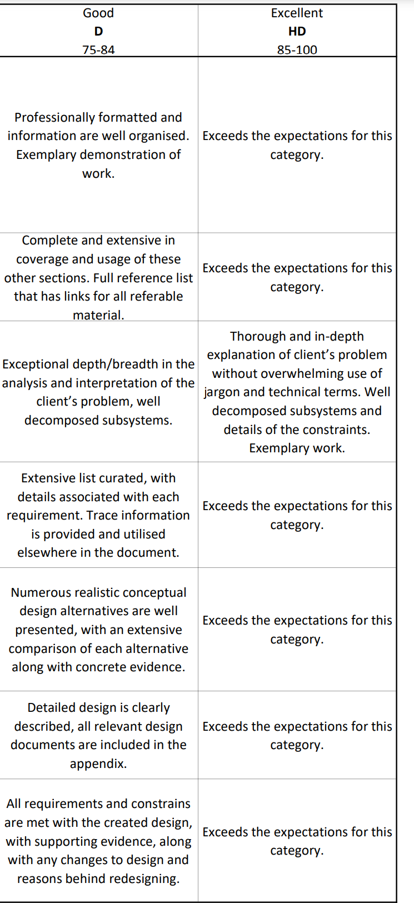

- [ ] Formatting and Professionalism (Leave till end)
- [x] Document Structure  (Reece) 
	- [x] Document Intro
	- [x] Document History
	- [x] Table of Contributions
	- [x] Preface
	- [x] Table of Contents
	- [x] List of Definition
	- [x] Appendicies
	- [x] References
- [x] Problem Definition (Blake)
	- [x] Intro of problem + Decoding
	- [x] Engineering problem and subsystems involved
	- [x] Details of constraints
- [x] Requirements (Specific, testable, with an ID and signoffs for interface) (Tyler Johnson)
	- [x] Functional
	- [x] Performance
	- [x] Interface
- [x] Conceptual Design(Tarun)
	- [x] Initial analysis and calculations (Tarun and Oliver) 
	- [x] **Realistic design alternatives** (Tarun)
	- [x] Comparison of design alternatives including evidence (Tarun)
- [x] Detailed Design (Tyler Johnson)
	- [x] Calculations (Tyler and Oliver)
	- [x] Described in detail
	- [x] Assumptions
	- [x] Diagrams and Schematics
	- [x] **CAD**
- [x] Design Tracability (Reece)
	- [x] All requirements and constraints are **satisfied and ticked off.**

All team members to cross check
- [ ] The funny