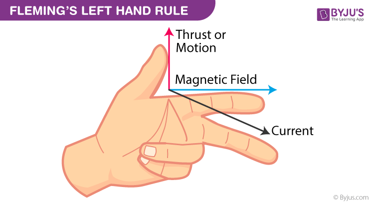

#MTRN/3026 

**Slides:**
[DC-motor](Attachments/DC-motor.pdf)


# Distilled Info
---

# Power in DC Motors
*Power output = Power input - Losses*

**Input**
$P_{in}=V_{in}I_{in}$  *For a DC motor*
$P_{in}= V_{in}I_{in}\cos \phi$ *For single phase AC*
$P_{in} = \sqrt{3V_{in}I_{in} \cos \phi}$

Therefore, *Power output:*
$$T_{out}= \omega _{m}T_{m}=\frac{2\pi N T_m}{60}$$

Efficiency:
$$\eta = \frac{P_{out}}{P_{in}}$$


# Mathematical Equations for analysing DC  Motors

## Performance Equation
*The following equations are used to analyse the operation of DC motors*
$$V = E_{a}+I_{a}R_{a}= K_{a} \phi \omega + I_{a}R_{a}$$
$$K_{a}= \frac{PZ}{2 \pi a}$$

**Torque Equation:**
$$T = K_{a}\phi I_a$$
$$I_{a} = \frac{V-E_{a}}{R_{a}} = \frac{V-K_{a} \phi \omega_{m}}{R_{a}}$$
$$\omega_{m} = \frac{V-I_{a}R_{a}}{K_{a} \phi} = \frac{V}{K_{a} \phi} - \frac{R_{a}}{K_{a}\phi}I_{a} = \frac{V}{K_{a}\phi} - \frac{R_{a}}{(K_{a}\phi)^{2}}T$$

The mechanical power output is $P_{m}=T\omega_{m}$
So, $E_{a}I_{a}= K_{a}\phi \omega_{m} I_{a} = \omega_{m}K_{a}\phi I_{a} = \omega_{m}T$

**Power Developed = Output power** WITHOUT LOSSES

## Model for Starting Performance
*Electric circuit equation is given by:*
$$V = L \frac{di_{a}}{dt} + Ri_{a}+k_{e}\omega $$

The dynamic equation of the motor under no-load condition is given by:
$$T = J \frac{d\omega}{dt} + B\omega$$
$$\omega = \frac{d\theta}{dt}$$

Motor torque, T, is given by:
$$T = K_{a}\phi i_{a} = k_{t}i_{a}$$
$\phi$ is kept constant for PM DC motor, $k_{t}$ is a constant and is known as armature constant.

**The back EMF is given by:**
$$e = K_{a}\phi \omega = k_{e}\omega$$
$k_{e}$ is constant and is known as the motor constant. Usually $k_{e} = k_{t}$

$$J \frac{d\omega}{dt}+B \omega = k_{t}I_{a}$$


## Motor-Load Connection Through a Gear
1. The power handled by the gear is the same on both sides.
2. Speed on each side is inversely proportional to its tooth number

$$T_{1}\omega_{1}= T_{2}\omega_{2}$$
OR
$$T_{2}= T_{1} \frac{\omega_{1}}{\omega_{2}}$$
$$\frac{\omega_{1}}{\omega_{2}}= \frac{N_{2}}{N_{1}}$$

Subbing in $\frac{\omega_1}{\omega_{2}}$ in $T_{2}= T_{1} \frac{\omega_1}{\omega_2}$
$$T_{2} = T_{1} \frac{N_{2}}{N_{1}}$$

Similar to a transformer, the constants of the load as reflected to the motor is:
$$J_{1(reflected)} = (\frac{N_{1}}{N_{2}})^{2} J_{1}$$
$$B_{2(reflected)} = (\frac{N_{1}}{N_{2}})^{2} B_{2}$$

$N_{1},N_{2}$ - Teeth number in the gear
$B_{1}, B_{2}$ - Bearings and their friction coefficients
$J_{m}, J_{L}$ - Moment of Inertia of the motor and load

Hence, the resultant mechanical constants are,
$$J = J_{m} + (\frac{N_{1}}{N_{2}})^{2} J_{1}$$
$$B = B_{1} + (\frac{N_{1}}{N_{2}})^{2}B_{2}$$
$J_{m}$ - Moment of inertia of motor
$B_{1}$ - Friction due to motor bearing
$J_{1}$ - Moment of inertia of gear system and load
$B_{2}$ - Friction due to gear system and load

Torque equation of the motor-load combination is:
$$J \frac{d\omega_{1}}{dt} + B\omega_{1} = T_{1}-T_{2(reflected)} = T_{1} - (\frac{N_{1}}{N_{2}})^{2}T_{2}$$


---

# [Actuators](../../../UNI%202022/MTRN2060/Actuators.md)
- Turn energy into movement.
- Usually needs control signals and power
- Control signal is usually low energy. Can be chemical, human, electrical, physical

## Actuator Systems
1. Electric motor
2. Power converter
	1. Rectifier
	2. Choppers #What
	3. Inverters
	4. Cycloconverters #What
3. Controllers  - Matching the motor and power converter to meet the *load* *requirement*.
4. Load - Load depends on the application: Current/Mass/Torque. Depends on electrical or mechanical. *How much work is required to be done?*

## Electric Motors
**Used for speed control applications**
1. DC Excited
	1. Shunt
	2. Series
	3. Compound
	4. Seperately Excited
	5. Switch reluctance motors #What 
2. AC Excited
	1. Induction - **Popular**
	2. Wound rotor synchronous
	3. Permanent Rotor Synchronous
	4. Reluctance Motor

# Fundamentals of Rotating Machines (Motors)
$$\text{Input power}\rightarrow \text{Rotating Machine} \rightarrow \text{Output power}$$

One motor driving another. The one being driven acts as a generator.

*Power output = Power input - Losses*

**Input**
$P_{in}=V_{in}I_{in}$  *For a DC motor*
$P_{in}= V_{in}I_{in}\cos \phi$ *For single phase AC*
$P_{in} = \sqrt{3V_{in}I_{in} \cos \phi}$

Therefore, *Power output:*
$$T_{out}= \omega _{m}T_{m}=\frac{2\pi N T_m}{60}$$

Efficiency:
$$\eta = \frac{P_{out}}{P_{in}}$$

## Operating Principles


We can use these rules to quickly determine the directions of forces and magnetic fields in induction questions.

**Fleming's Left Hand Rule**
$$F = iL * B$$

Or we use our old friend:
$$F = BiL \sin \theta$$
*Bill Returns*
Theta is our angle between them if not 90 degrees.

## Force on a Charge

*For a stationary charge in an electric field:*
$$F = QE$$

*For a charge in motion or moving charge in magnetic field:*
$$F = Qv*B$$

*Combination of electric and magnetic field:*
$$F = Q(E+vB)$$
**Known as the Lorentz force equation.**

F = Force on the charge Q (N)
E = Electric field intensity
Q = Charge (Coulumbs)
B = Magnetic Field Strength
Where * is dot product symbol

## Brushed DC Motors
- Winding assembly with stationary magnetic field
- Brushes and commutators switch current to different windings *in correct relation to the outer permanent magnetic field.*


| Pros                                           | Cons                                               |
| ---------------------------------------------- | -------------------------------------------------- |
| Simple electronics as control is not necessary | Sensors required for speed control                 |
| Requires only four power transistors           | Brushes and commutators create sparks and wear out |
|                                                | Sparks limit peak power                            |
|                                                | Heat in armature is difficult to cool              |
|                                                | Low power density                                  |

1.5mm motor lamination
3mm Transformer lamination

## Different Connections of DC motors with Field Windings
Usually the field winding is supplied with a source for excitation. Here are a couple of different excitation configurations.


#What #Why 
Combination of different methods of getting power to both armature and rotor.

## DC Motor Characteristics


## Losses
- $I^{2}R$ Loss (copper loss): Motor winding (stator and rotor)
- Magnetic Loss: (Eddy current and hysteresis)
- Friction and windage loss: (Rotational loss or mechanical loss)

Manifest in the form of *HEAT* and increases the temperature of the winding of the motor. Cooling *FAN* is required to maintain the *TEMPERATURE.*

**Hysteresis Loss:**
$P_{h}= f \int B$ dH $W/{m^{3}}$


**Eddy Current Loss:**
$$P_{e}= \frac{\pi^{2}B^{2}_{m}f^{2}t^{2}}{6 \rho}$$

# Mathematical Equations for analysing DC  Motors

## Performance Equation
*The following equations are used to analyse the operation of DC motors*
$$V = E_{a}+I_{a}R_{a}= K_{a} \phi \omega + I_{a}R_{a}$$
$$K_{a}= \frac{PZ}{2 \pi a}$$

**Torque Equation:**
$$I_{a} = \frac{V-E_{a}}{R_{a}} = \frac{V-K_{a} \phi \omega_{m}}{R_{a}}$$
$$\omega_{m} = \frac{V-I_{a}R_{a}}{K_{a} \phi} = \frac{V}{K_{a} \phi} - \frac{R_{a}}{K_{a}\phi}I_{a} = \frac{V}{K_{a}\phi} - \frac{R_{a}}{(K_{a}\phi)^{2}}T$$

The mechanical power output is $P_{m}=T\omega_{m}$
So, $E_{a}I_{a}= K_{a}\phi \omega_{m} I_{a} = \omega_{m}K_{a}\phi I_{a} = \omega_{m}T$

**Power Developed = Output power** WITHOUT LOSSES

## Model for Starting Performance
*Electric circuit equation is given by:*
$$V = L \frac{di_{a}}{dt} + Ri_{a}+k_{e}\omega $$

The dynamic equation of the motor under no-load condition is given by:
$$T = J \frac{d\omega}{dt} + B\omega$$
$$\omega = \frac{d\theta}{dt}$$

Motor torque, T, is given by:
$$T = K_{a}\phi i_{a} = k_{t}i_{a}$$
$\phi$ is kept constant for PM DC motor, $k_{t}$ is a constant and is known as armature constant.

**The back EMF is given by:**
$$e = K_{a}\phi \omega = k_{e}\omega$$
$k_{e}$ is constant and is known as the motor constant. Usually $k_{e} = k_{t}$

$$J \frac{d\omega}{dt}+B \omega = k_{t}I_{a}$$

```ad-note
At $t = 0$, both $i_{a}$ and $\omega$ are 0
```

## Chopping and Speed Control

We can "chop" the voltage to our motor to control the speed using PWM.
In automated systems, we use a transistor switch and a *flyback diode which accommodates the back EMF generated by the motor.*

## DC Motor H-Bridge
In the above diagram, we are unable to run the motor backwards. This can be solved using an H-Bridge. This is a common circuit in DC motor control and very popular.


- Transistors are switched diagonally to allow the DC current to flow in the motor in either direction. We can use PWM with the transistors to reduce average voltage at the motor for speed control.
- *If transistors are enabled vertically (either both the left or both the right) it causes a shoot through fault. This can fry or damage the motor. ***DO NOT DO THIS.**

We have a circuit below of what a typical H-bridge looks like in practice:


## BLDC Motor VS Brushed DC Motor
A table for reference for Brushless DC Motors compared to Brushed DC Motor


# Selecting Motors
1. *Cost* - BLDC is higher, Brushed is lower
2. *Thermal Capacity* - Dependent on motor
3. *Efficiency* - BLDC is high, Brushed is moderate (sparks in brushes reduce peak power)
4. *Torque-speed profile* - BLDC has a flat TSP, Brushed has a moderately flat TSP that lowers at high speed due to friction.
5. *Acceleration* - Dependent on motor
6. *Power Density* - Dependent on motor
7. *Volume of the motor* - Dependent on motor 
8. *Peak torque capability* - Dependent on motor
9. *Peak torque capability* - Dependent on motor
10. *Availability of spare parts* - Dependent on motor and **supplier**
	- Important to check with supplier about part availability and future support

## Example Specs - Sydney Trains and Sydney Metro

| Catagory                       | T set                                                                     |     |
| ------------------------- | -------------------------------------------------------------------------- | --- |
| Traction Motors           | 4 x 170kW (230hp) 2-phase DC shunt-wound motor MB-3303-B (Mitsubishi Elec) |     |
| Power Output              | 680kW (910hp) (4-car) 1,360kW (1,820hp) (8-car)   | 
| Electric Systems          |                                     1,500V DC caternary                                       |
| Current collection method |                           Pantograph                                                 | 

| Catagory           | M set                                                           |
| ------------------ | --------------------------------------------------------------- |
| Traction System    | IGBT-VVVF (Alstom ONIC 1500)                                    |
| Traction Motors    | 4 x 226kW (303hp) 3-phase AC induction motor (Alstom ONIX 1500) |
| Power Output       | 904kW (1,212hp) (4-car) 1,808kW (2,425hp) (8-car)           |
| Electric System(s) |               1,500V DC catenary                                                  |

These systems use ORCS (Overhead Rigid Conductor rail System)

# Load
The motor drives a load which has a certain characteristics torque-speed requirement. In general: 
$$T_{L} \propto \omega^{k}_{m}$$

Where, k may be an integer or a fraction.

**In a feed drive,**
$$T_{L} \propto \omega_{m}$$

**In fans and pumps:**
$$T_{L}\propto \omega_{m}^{2}$$
- The motor can be connected to the load through a set of gears
- The gears have teeth ratio can be treated as torque transformers
- Gears can be used to amplify the torque on load side at lower speed.
- The motors are designed to run at high speeds - because it has been found that the higher speed, the lower is the volume and size of the motor.

## Coupling of Loads with Motor:

There are a number of transmission methods and coupling solutions. See here for some more depth on transmission. [Week 11 - Motors and Motor Selection](../../SEM%201/MECH2003/Week%2011%20-%20Motors%20and%20Motor%20Selection.md)

## Motor-Load Connection Through a Gear
1. The power handled by the gear is the same on both sides.
2. Speed on each side is inversely proportional to its tooth number

$$T_{1}\omega_{1}= T_{2}\omega_{2}$$
OR
$$T_{2}= T_{1} \frac{\omega_{1}}{\omega_{2}}$$
$$\frac{\omega_{1}}{\omega_{2}}= \frac{N_{2}}{N_{1}}$$

Subbing in $\frac{\omega_1}{\omega_{2}}$ in $T_{2}= T_{1} \frac{\omega_1}{\omega_2}$
$$T_{2} = T_{1} \frac{N_{2}}{N_{1}}$$

Similar to a transformer, the constants of the load as reflected to the motor is:
$$J_{1(reflected)} = (\frac{N_{1}}{N_{2}})^{2} J_{1}$$
$$B_{2(reflected)} = (\frac{N_{1}}{N_{2}})^{2} B_{2}$$

$N_{1},N_{2}$ - Teeth number in the gear
$B_{1}, B_{2}$ - Bearings and their friction coefficients
$J_{m}, J_{L}$ - Moment of Inertia of the motor and load

Hence, the resultant mechanical constants are,
$$J = J_{m} + (\frac{N_{1}}{N_{2}})^{2} J_{1}$$
$$B = B_{1} + (\frac{N_{1}}{N_{2}})^{2}B_{2}$$
$J_{m}$ - Moment of inertia of motor
$B_{1}$ - Friction due to motor bearing
$J_{1}$ - Moment of inertia of gear system and load
$B_{2}$ - Friction due to gear system and load

Torque equation of the motor-load combination is:
$$J \frac{d\omega_{1}}{dt} + B\omega_{1} = T_{1}-T_{2(reflected)} = T_{1} - (\frac{N_{1}}{N_{2}})^{2}T_{2}$$

## Load Characteristics
- The process of selecting an adjustable AC or DC drive is one where load is primary consideration.
- When considering load characteristics:
	- What type of load is associated with the application?
	- What is the size of the load?
	- Does the load involve heavy inertia? (Large mass or mass a long way from the shaft)
	- What are the motor considerations?
	- Over what speed range are heavy loads encountered?

## Load Types
### Constant Torque Load:
In this group, the torque demanded by the load is constant throughout the speed range.
*Constant torque. Horsepower varies. General machinery hoists, conveyors, printing presses*

$$P = T\omega$$
**IN HORSEPOWER**
*Loads of this type are essentially friction loads (Conveyors, extruders, and surface winders)*

### Constant Horsepower Load:
Horsepower demanded by the load is constant within the speed range. The load requires high torque at low speeds.
*Constant horsepower. Torque varies inversely with speed*

*Examples: Center-driven winders and machine tool spindles*
Applications:
- Metal cutting tools operating over wide speed range, mixer, extruder and special machines where operation at low speed may be continuous.

### Variable Torque Load:
$$\text{Load Torque} = (\text{Torque Constant})(\text{Speed})^{2}$$
*Horsepower varies as square of the speed, torque varies with speed. Positive displacement pumps, some mixers, some extruders.*


# Control of Electric Motors
**Servo Controllers:** Offer extremely fast response and precise control of acceleration/deceleration, speed and torque. Servo Control System can accelerate from standstill to 100 RPM in several milliseconds.

**Servo Control Systems are designed with three feedback loops:**
- Position loop
- Velocity loop
- Current loop

*Elements of Servo Control System are:*
1. Motor
2. Power Converter
3. Load and Transmission Systems
4. Encoder (like for steppers, position transducer)
5. Tachometer (speed transducer)
6. Current and Voltage Sensors
7. Potentiometers

Below is a signal diagram of a basic control system.


