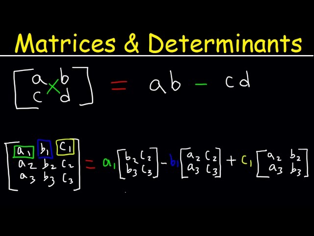

[Week 9](Attachments/Week%209-%20lecture%20workshop.pdf)
# Maths and Distilled Info
---
## Robotic Singularities
Refers to a specific position where the robot arm or mechanism loses one or more degrees of freedom. Making it unable to be controlled properly.
- **Momentary**: Brief or temporary pass through a singular config. Does not remain stuck
- **Permanent Singularity**: Robot arm becomes mechanically locked or reaches a config where it cannot continue without external intervention

Singularities happen **when our Jacobian matrix is not Invertible**
$$v = J \theta$$
$v$ = Cartesian Velocities
$J$ = Jacobian
$\theta$ = Joint velocities

$$\text{If } Det(J) \neq 0 \text{ J is invertble}$$
$$\text{If } Det(J) \approx 0 \text{ Is invertible but  dangerous joint velocities will occur}$$

# Conceptual Info
---

## The Importance of AI
**Automation and Efficiency**: automation of repetitive and time-consuming tasks, increasing efficiency and productivity in various industries
**Data-driven Decision Making**: AI analyzes vast datasets quickly and accurately, helping organizations make data-driven decisions for better outcomes and insights.
**Innovation and Problem Solving**: AI fosters innovation by solving complex problems and enabling the development of new technologies, products, and services
**Personalization and User Experience**: AI-driven personalization enhances user experiences in applications such as e-commerce, entertainment, and healthcare
**Addressing Global Challenges**: AI contributes to solving global challenges like climate change, healthcare access, and cybersecurity by providing tools for predictive modeling, disease diagnosis, and risk assessment.

## Generative Models
### Generative Adversarial Networks (GANs)
- Two neural networks compete with eachother to become more accurate in their prediciton, using deep learning methods.
- Typically run unsupervised and use a cooperative zero-sum game framework to learn where ones gains equals another's loss.

### Variational Autoencoders (VAEs)
- Alternative form of autoencoders (neural network used primarily for compression and feature learning)
- VAEs have the added ability to generate new data points that are similar to the training data, making them useful for generative applications

### Reinforcement Learning (RL)
RL is a subfield of machine learning where an agent (model) learns to make a sequence of decision by interacting with an environment to maximise cumulative reward signal. It is inspired by the behavioural psychology concept of learning through trial and error.

Leverages generative models and reinforcement learning.

## Generative AI Uses

### Generative AI in Robotics
1. Simulated environments generated by computer allow ML models to be tested in simulated real world scenarios.
	1. Safe
	2. Cost effective
	3. Rapid prototyping
	4. Scalability
	5. Repeatable Experiments
	6. Data generation
	7. Complex scenarios
	8. 24/7 Uptime
2. Data Augmentation with Generative Models improve the diversity of training data
	1. Enhancing training data quantity
	2. Improving data quality
		1. Noise reduction
		2. Anomaly detection
	3. Continuous learning

### Generative AI in Automation
1. Enhancing Industrial process efficiency
	1. Automation of Repetitive Tasks
	2. Precision and Accuracy
	3. Optimise resource allocation
	4. Predictive maintenance
	5. Quality control
2. Product Development
	1. Generative design using outlined design goals and requirements
	2. Generation of design alternatives and variations
	3. Continuous refinement
	4. Performance optimization
	5. 3D printing compatibility

## AI VS Machine Learning VS Deep Learning

## Neural Network Topologies
### Perceptron (P) (Single Layer)

Used for classification. Has only input and output cells. Not capable of higher order tasks

### Feedforward (FF)

- Nodes do not ever form a cycle.
- All perceptrons are arranged in layers where the input layer takes input, the output layers give output. Other than input the hidden cells have no connection to the outer world.
	- Data compression
	- Pattern recog
	- Computer Vision
	- Speech recog
	- Hand written character recog
- 

# Additional Content
---
