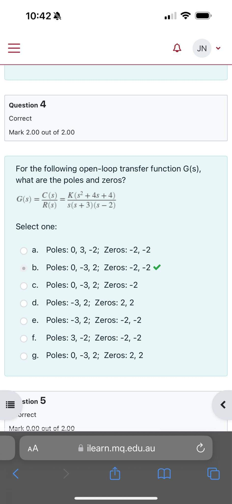
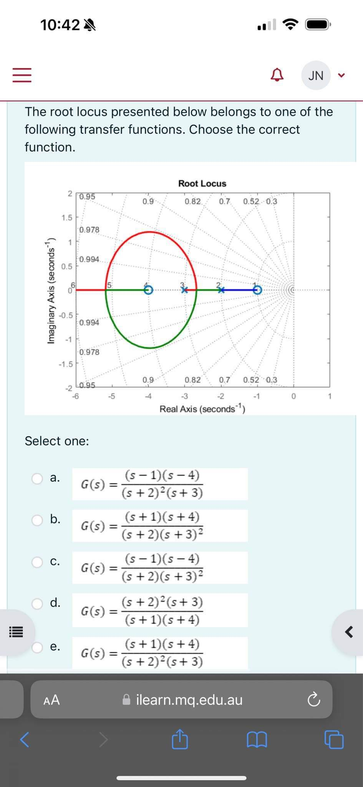

```ad-note
**Poles** of a transfer function are the values of the Laplace transform variable, $s$, that cause the transfer function to become infinite.

**Zeros** of a transfer funtion are the values of the Laplace transform variable, $s$, that cause the transfer function to become zero.

```
# Block Diagrams

Cascaded SystemsParallel subsystems
Feedback systems

# Time Response
## First-Order System


We have poles at -5 and zeros at -2
$C(s) = G(s)R(s) = \frac{s+2}{s+5} * \frac{1}{s} = \frac{s+2}{s(s+5)}$
We separate C(s) into $\frac{A}{s}+\frac{B}{s+5}$  using [[Partial Fractions]]


```ad-note
Input pole is the pole of our input $1/s$

```
We can convert our output transform$$\frac{\frac{2}{5}}{s} + \frac{\frac{3}{5}}{s+5}$$
To our output time response:
$$c(t) = \frac{2}{5} + \frac{3}{5}e^{-5t}$$

#### Example
Given the system below, specify the natural and forced parts of the output 


### First Order Systems

Initial slope $= \frac{1}{\text{time constant}} = a$

```ad-note

**Time constant**
$\frac{1}{a}$ it is the time it takes for the step response to rise to 63% of its final value.

**Rise time $T_{r}$**
Time for the waveform to go from 0.1 to 0.9 of its final value.

**Settling time $T_{s}$**
time for the response to reach, and stay within 2% of its final value.
$$T_{s}=\frac{4}{a}$$

```

### First Order Transfer Functions via Testing
With a step input, we can measure the time constant and the steady-state value, from which the transfer function can be calculated.
Let first order system be  $G(s) = \frac{K}{s+a}$
And the step response $C(s) = \frac{K}{s(s+a)} = \frac{K /a}{s}-\frac{K /a}{s+a}$
1. Final value = 0.72
2. 63% of final value $= 0.63*0.72 = 0.45$
3. Curve reaches 0.45 at 0.13s hence $a = 1/0.13 = 7.7$
4. Steady state value $K/a = 0.72,$ hence $K = 0.72*7.7 = 5.54$
$$G(s) = \frac{5.54}{s+7.7}$$


## Second Order Systems

There are four possible response (when $a \geq 0$ and $b>0$):
1. **Overdamped responses**
	*Poles*: Two real at $- \sigma_{1}, - \sigma_{2}$ . Where $\sigma_{1} \neq \sigma_{2}$ and $\sigma_{1},\sigma_{2}>0$
	*Natural Response:* Two exponentials with time constants equal to the reciprocal of the pole locations, or:
	$$c(t) = K_{1} e^{- \sigma_{1} t} + K_{2} e^{- \sigma_{2} t}$$
2. **Underdamped response**
	*Poles*: Two complex at $- \sigma_{d} \pm j \omega_{d}$  and $\sigma_{d} > 0$
	*Natural Response:* Damped sinusoid with an exponential envelope whose time constant is equal to the reciprocal of the pole's real part. The radian frequency of the sinusoid, the damped frequency of oscillation, is equal to the imaginary part of the poles, or:
	$$c(t) = A e^{-\sigma_{d}t}*\cos(\omega_{d}t - \phi)$$
	Where $\omega_d$ is the damped frequency of oscillation
	
3. **Undamped response**
	*Poles:* Two imaginary at $\pm j \omega_{1}$
	*Natural Response:* Undamped sinusoid with radian frequency equal to the imaginary part of the poles, or
	$$c(t) = A \cos (\omega_{1} t - \phi )$$
	
4. **Critically damped responses**
	*Poles:* Two real at $- \sigma_{1}$ and $\sigma_{1} > 0$
	*Natural Response:* One term is and exponential whose time constant is equal to the reciprocal of the pole location. Another term is the product of time, t, and an exponential with time constant equal to the reciprocal of the pole location:
	$$c(t) = K_{1} e^{- \sigma_{1}t}+K_{2} t e^{- \sigma_{1} t} $$

### General Second Order Systems
**Natural Frequency** $\omega_{n}$
The frequency of oscillation without damping

**Damping ratio** $\zeta$
$$\zeta= \frac{\text{Exponential decay freq}}{\text{Natural frequency (rad/s)}}= \frac{1}{2 \pi} \frac{\text{Natural Period (s)}}{\text{Exponential time constant}}$$

Consider $G(s) = \frac{b}{s^{2}+as+b}$
Lets determine what is the term a and B in terms of omega and zeta
Without damping (a=0) the poles are on the imaginary axis and $G(s) = \frac{b}{s^{2} + b}$
Then 
$\omega_{n} = \sqrt{ b }$
$b = \omega_{n}^2$

Now we assume an underdamped system. The real part of the complex pole is $\sigma = -a / 2$
and it determines the exponential decay frequency.

Hence:
$$\zeta = \frac{\text{Exponential decay freq}}{\text{ Natural freq (rad/s)}}= \frac{|\sigma|}{\omega_{n}}= \frac{\frac{a}{2}}{\omega_{n}} \rightarrow a = 2 \zeta \omega_{n}$$

Then, the general second-order transfer function is:
$$G(s) = \frac{b}{s^{2}+ as + b} = \frac{\omega_{n}^{2}}{s^{2}+ 2 \zeta \omega_{n}s + \omega_{n}^2}$$
where 
$b = \omega_{n}^2$
$a= 2 \zeta \omega_{n}$

The poles of this transfer function are:
$$s_{1,2} = -\zeta \omega_{n} \pm \omega_{n} \sqrt{ \zeta^{2}-1 }$$
$$s_{1,2} = - \zeta \omega_{n} \pm j \omega_{n} \sqrt{ 1-\zeta^2 }$$

### Underdamped Second Order Systems
Step response: $C(s) = \frac{\omega_{n}^{2}}{s(s^{2}+2 \zeta \omega_{n} s + \omega_{n}^{2})} = \frac{K_{1}}{s} + \frac{K_{2}s+K_{3}}{s^{2}+2 \zeta \omega_{n}s + \omega_{n}^{2}}$
Expanding by partial fraction we obtain $(0 < \zeta < 1)$:
$$C(s) = \frac{1}{s} - \frac{(s+\zeta \omega_{n})+ \frac{\zeta}{\sqrt{ 1- \zeta^2 }}\omega_{n}\sqrt{ 1-\zeta^2 }}{(s + \zeta \omega_{n})^{2}+\omega_{n}^{2}(1-\zeta^{2})}$$

Then in time domain:
$$c(t) - 1 - e^{- \zeta \omega_{n} t} \left(  \cos  \omega_{n}\sqrt{ 1- \zeta^{2} }t + \frac{\zeta}{\sqrt{  1-\zeta^{2} }}\sin \omega_{n} \sqrt{ 1- \zeta ^{2} }t \right)$$
$$= 1 - \frac{1}{\sqrt{ 1-\zeta^{2} }}e^{- \zeta \omega_{n}t} \cos (\omega_{n} \sqrt{  1- \zeta^{2} }t - \phi )$$

Where: $\phi = \tan^{-1}\left( \frac{\zeta}{\sqrt{  1- \zeta^2 }} \right)$

**Specifications:**
1. *Rise time* $T_{r}$ The time required for the waveform to go from 0.1 of the final value of 0.8 of the final value
2. *Peak time* $T_{p}$ the time required to reach the first or maximum peak.
3. *Percent overshoot* %OS the amount that the waveform overshoots the steady state, or final value at the peak time, expressed as a percentage of the steady state value.
4. *Settling time* $T_{s}$ The time required for the transient's damped oscillations to reach and stay within $\pm{2}$% of the steady state value.


**Evaluate $T_{p}$**
$T_{p}$ is found by differentiating c(t) and finding the first zero crossing after t=0.
$$T_{p} \frac{\pi}{\omega_{n} \sqrt{  1- \zeta^{2}}}= \frac{\pi}{\omega_{d}}$$


**Evaluate %OS**
$$\% OS = e ^{-(\zeta \pi / \sqrt{ 1-\zeta^2 })}*100$$
$$\zeta= \frac{- \ln (\% OS / 100)}{\sqrt{ \pi^{2}+ \ln ^{2} (\%OS / 100) }}$$


**Evaluation of $T_{s}$**
$$e^{-\zeta \omega_{n} t} \frac{1}{\sqrt{ 1- \zeta^{2} }}=0.02$$
$$T_{s} = \frac{-\ln (0.02 \sqrt{  1-\zeta^2 })}{\zeta{\omega_{n}}}$$
$$T_{s} \approx \frac{4}{\zeta \omega_{n}}$$

**Evaluation of $T_{r}$**
-Cannot be found analytically?

#### Example
Find Tp %OS, Ts, and Tr for the transfer function

$$G(s) = \frac{100}{s^{2}+ 15s + 100}$$

$T_{p} = \frac{\pi}{\omega_{n} \sqrt{ 1- \zeta^{2} }}=0.475$

$\% OS = e^{-(\zeta \pi / \sqrt{ 1-\zeta^{2} })}*100=2.838$

$T_{s} \approx \frac{4}{\zeta \omega_{n}} = 0.533$

$T_{r} \approx \frac{2.3}{ \omega_{n}} = 0.23$

Where 2.3 is a normalised rise time corresponding to $\zeta$

#### Example 2
Given the plot, find $\zeta, \omega_{n}, T_{p}, \%OS \text{ and } T_{s}$

**Solution**
$\zeta= \cos \theta = \cos\left[ \arctan\left( \frac{7}{3} \right) \right] = 0.394$
$\omega_{n} = \sqrt{ 7^{2}+3^{2 }}= 7.62$
$T_{p} = \frac{\pi}{\omega_{d}} = \frac{\pi}{7} = 0.449$ seconds
$\%OS = e^{-(\zeta \pi / \sqrt{ 1-\zeta^{2 }})}*100= 26\%$


#### Example 3
Find J and D to yield a 20% overshoot and $T_{s} = 2s$ for step input torque $T(t)$

$$G(s) = \frac{1 / J}{s^{2}+\frac{D}{J}s+\frac{K}{J}}$$

$\omega_{n} = \sqrt{ \frac{K}{J} }$
$2 \zeta \omega_{n} = \frac{D}{J}$


$\% OS = 20 \rightarrow \zeta = 0.456$
$$T_{s} = 2 \approx \frac{4}{\zeta \omega_{n}} \rightarrow \sqrt{  \frac{K}{J} } = \frac{2}{\zeta} \rightarrow \frac{J}{K} = 0.052 \rightarrow J = 0.26$$
$$D = 2 J \zeta \omega_{n} = 2 \zeta\sqrt{KJ} = 1.04$$


### System Response with Additional Poles


#### Example
Find the step response of the transfer functions below and compare them:
$$T_{1}(s) = \frac{24.542}{s^{2}+4s + 24.542}$$
$$T_{2}(s) = \frac{245.42}{(s+10)(s^{2}+ 4s + 24.542)}$$
$$T_{3}(s) = \frac{73.626}{(s+3)(s^{2}+4s + 24.542)}$$

**Solution** Taking the laplace inverse transform $C_{i}(s) = T_{i}(s)R(s) for R(s) = s^{-1}$ and $i = 1,2,3$ gives

$$c_{1}(t) = 1-1.09e^{-2t} \cos(4.532t - 23.8 \degree)$$
$$c_{2}(t) = 1-0.29 e^{10t}-1.189 e^{-2t} \cos (4.532t-53.34\degree)$$
$$c_{3}(t) = 1-1.14 e^{-3t}-0.707 e^{-2t} \cos (4.532t-78.63\degree)$$


## System Response with Zeros
$$T(s) = \frac{(s+a)}{(s+b)(s+c)} = \frac{A}{(s+b)}+\frac{B}{(s+c)}$$
$$ = \frac{(-b+a) / (-b+c)}{s+b} + \frac{(-c+a) / (-c+b)}{s+c}$$
$$\text{If } a\gg b,c: T(s) \approx a \left[ \frac{1 / (-b+c)}{s+b} + \frac{1 / (-c +b)}{s+c} \right] = \frac{a}{(s+b)(s+c)}$$
Zero looks like a simple gain factor and does not change the relative amplitudes of the components of the response.

- Let C(s) be the response of a system, T(s) with unity in the numerator
- If we add a zero to the transfer function, yielding $(s+a)T(s)$ the laplace transform of the response will be:

$$(s+a)C(s) = sC(s) + aC(s)$$
**If a is very large and positive** then the response is approximately a scaled version of the original response.
**If a is small and positive** then the derivative term has a greater effect on the response ***more overshoot***
**If a is negative (right half plane)** then the derivative term will be of a opposite sign from the scaled response term.
### Pole Zero Cancellation
Consider:
$$T(s) = \frac{K(s+z)}{(s+p_{3})(s^{2}+as+b)}$$
if the zero at $-z$ is very close to the pole at $-p_{3}$ then it can be shown using partial fraction expansion of T(s) that the residue of the pole at **p3 is much smaller than any other residues**

#### Example
For the response functions below determine whether there is an approximate pole-zero cancellation and if so, find an approximate second order response.
$$C_{1}(s) = \frac{26.25 (s+4)}{s(s+{3.5})(s+5)(s+6)}$$
$$C_{2}(s) = \frac{26.25 (s+4)}{s(s+4.01)(s+5)(s+6)}$$

**Solution**
$C_{1}(s)$ has no approximate cancellation

$$C_{2}(s) = \frac{26.25(s+4)}{s (s+4.01)(s+5)(s+6)}$$
$$C_{2}(s) = \frac{0.87}{s}- \frac{5.3}{s+5} + \frac{4.4}{s+6} + \frac{0.033}{s+4.01} $$
Approximate cancellation, coefficient of the last term is at least an order of magnitude smaller than the others

$$C_{2}(s) \approx \frac{0.87}{s}-\frac{5.3}{s+5}+\frac{4.4}{s+6}$$
$$c(t) \approx 0.87 - 5.3 e^{-5t}+4.4e^{-6t}$$
An approximate overdamped second order response

# Stability and Steady State Errors
## Stability

$$c(t) = c_{\text{forced}}(t) + c_{\text{natural}}(t)$$

A system is **stable** if the natural response approaches zero as time approaches infinity
*Stable systems have closed-loop transfer functions with poles only in **left hand plane (negative real part)***

A system is **unstable** if the natural response approaches infinity as time approaches infinity
*Unstable systems have closed loop transfer functions with at **least one pole in the right half-plane (positive real part) and/or poles of multiplicity greater than one on the imaginary axis***

A system is **marginally stable** if the natural response neither decays nor grows but remains constant or oscillates
*marginally stable systems have closed loop transfer functions with **only imaginary axis poles of multiplicity 1** and poles in the **left hand plane***


```ad-note
These definitions assume implicitly there have been are **no cancellations of RHP and/or certain imaginary axis poles!** There are systems that after cancellation only has LHP poles left, yet is unstable for non-zero initial conditions

```

## System Type

$$n = 0\dots \text{Type 0 system}$$
$$n =1 \dots \text{Type 1 system}$$
$$n = 2\dots \text{Type 2 system}$$


### Example
 For the closed-loop system below, find the static error constants and the expected error for the standard step, ramp, and parabolic inputs


### Example 2
Given the control system, find the value of K so that there is 10% error in the steady state.


### Example 3
Find the steady-state error component due to a step disturbance for the system below


## Steady-State Errors
**Steady state error** is the difference between the input and the output for the prescribed test input as $t \rightarrow \infty$

Test waveforms for evaluating steady-state errors of control systems


## Steady-State Error for Unity Feedback Systems

Steady-State Error in terms if T(s) - *closed loop transfer function*


$$E(s)  = R(s) - C(s)$$
$$E(s) = R(s) [1-T(s)]$$
$$e(\infty)  \lim_{ t \to \infty } e(t) = \lim_{ s \to 0 } s E(s) $$
...final value theorem (keep in mind valid conditions)
$$e(\infty) = \lim_{ s \to \infty } s R(s)[1-T(s)]$$


### Steady-State Error in Terms of G(s) - open loop transfer function


$$E(s) = R(s) - C(s)$$
$$C(s) = E(s)G(s)$$

$$E(s) = \frac{R(s)}{1+G(s)}$$
$$e(\infty) = \lim_{ s \to 0 }  \frac{sR(s)}{1+G(s)}$$


### Static Error Constants and System Type

Position Constant $K_{p}$ where $K_{p} = \lim_{ s \to 0 } G(s)$

Velocity Constant, $K_{v} = \lim_{ s \to 0 } sG(s)$

Acceleration Constant, $K_{a}$, where $K_{a} = \lim_{ s \to 0 }s^{2}G(s)$

For a step input: 
$$e_{step} (\infty) = \frac{1}{1+ \lim_{ s \to 0 } G(s)}$$
$$e(\infty) = \frac{1}{1+K_{p}}$$

For a ramp joint:
$$e_{ramp}(\infty)=\frac{1}{\lim_{ s \to 0 } sG(s)}$$
$$e(\infty) = \frac{1}{K_{v}}$$

For a parabolic input:
$$e_{\text{parabolic}} (\infty) = \frac{1}{\lim_{ s \to 0 } s^{2}G(s)}$$
$$e(\infty) = \frac{1}{K_{a}}$$


## Steady-State Error for Non-unity Feedback Systems
- Control systems often **do not have unity feedback** because of the compensation used to improve performance or because of the physical model for the system. 
- When **nonunity feedback** is present, the plant's **actuating signal is not the actual error** or difference between the input and the output


# Routh-Hurwitz Criterion
Yields stability information without need to solve for the closed-loop system poles
1. Generate *Routh Table*
2. Interpret table to determine how many closed loop system poles are in the LHP and in the RHP

```ad-note
Any row of the Routh table can be multiled by a positive constant without changing the values of the rows below

```

The number of roots of the polynomial that are in the right half plane is equal to the number of sign changes in the first column

Two sign changes, hence two poles in the right half-plane. System unstable

Two edge cases
1. The Routh table can have a zero only in the first column of a row
2. The Routh table can have an entire row that consists of zeros

Keep in mind: A zero does not have a definite sign. Zeros do not count as sign changes. Must watch out for them in the first column.

### Examples
Find the range of gain K > 0 for the system below that will cause the system to be stable, unstable, and marginally stable.

 - If K < 1386 then there will be no sign change in the first column, so system is stable. 
 - If K > 1386 the first element of the third row becomes negative so that there will be two sign changes and the system has two RHP poles. So, in this case it is not stable.

# Root Locus
## Vector Representation of Complex Numbers (1)


$$\bar{M} = Me^{j \text{ (phase of m)}}$$
$$F(s) = s  + a  = (\sigma + a) + j \omega $$

Bottom right is a different way to draw the same vector, we aren't concerned with location
Zeros are now at $- a$

Bottom right we are evaluating $F(s) = s + 7$ at the point $s = 5  + j2$
We pin the end of the vector at $5+j2$ and draw the zero at -7.

Same as if we drew the start at 0 and the end is $12+j2$

**PHASE ANGLE AND MAGNITUDE REMAINS THE SAME**

$(s+a)$ is a complex number and can be represented by a vector drawn from the zero of the function to the point s


Apply this to something more complex

Product of all zeroes of the function over the product of all poles $\prod$  = product


Each complex factor can be expressed as a vector of magnitude $M$ and angle $\theta$


Vector written as
$$|F(s)|  \text{  = Length of vector}$$
$$\angle F(s) \text{ = is the phase angle}$$
$$\text{ We can also use } M\angle \theta$$

$$(s+z_{1})(s+z_{2})= M_{1} e^{j \phi_{1}}*M_{2}e^{j \phi _{2}} = M_{1} M_{2} e^{j(\phi_{1}+\phi_{2})}$$
Division we change to $\phi_{1}-\phi_{2}$

**Closed loop transfer function**


**Pole location as a function of gain for the camera system**

Location of poles as gain changes

These form a limit, here around -5.
Starting point is when gain = 0

## Properties of the Root Locus

$s_{}$ is a pole of $T(s)$ if the denominator is 0.
$$1 + KG(s)H(s) = 0$$
$$KG(s)H(s) = -1$$

Alternatively

the angle of the complex number is an **odd** multiple of 180 degrees. That value of s is a system pole for some value of K.
180 * (1, 3, 5, 7 etc)

## Sketching the Root Locus
1. **Number of branches** - Number of branches of the root locus equals the number of closed-loop poles
2. **Symmetry** - The root locus is symmetrical about the real axis
3. **Real-axis segments** - On the real axis, for K>0 the root locus exists to the left of a pole if there are an odd number of poles before it (inclusive of that pole), finite open-loop poles and/or finite open-loop zeros.

Here the root locus is in blue
Xs are poles
Dots are zeros
4. **Starting and ending points** - The root locus begins at the finite and infinite poles of G(s)H(s) and ends at the finite and infinite zeroes of G(s)H(s). Begins when gain is 0.
5. **Behaviour at infinity** - The root locus approaches straight lines as asymptotes as the locus approaches infinity. Further, the equations of the asymptotes are given by the real-axis intercept and angle in radians as follows.

$\sigma_{a}$ is the coordinate the asymptote crosses the x axis
$$\sigma_{a}  = \frac{\sum \text{ finite poles} - \sum \text{finite zeros}}{\text{ num of poles - num of zeroes}}$$

$$\theta_{a} = \frac{(2k+1)\pi }{\text{num of finite poles - num of finite zeroes}}$$
where k is pm 0, 1, 2, 3...

6. **Real axis breakaway and break in points** - The root locus breaks away from the real axis at a point where the gain is maximum and breaks into the real axis at a point where the gain is minimum
$$KG(s)H(s) = -1 - 1 \angle (2k+1)180 \degree$$
$$K = -\frac{1}{G(s)H(s)} $$


For points along the real-axis segment of the root locus where breakaway and break-in points could exist $s = \sigma$

$$K = - \frac{1}{G(\sigma)H(\sigma)}$$

$\frac{dK}{d \sigma} = 0$ solving for $\sigma$ we find breakaway and break-in points
looking for minimum points (breakin) and maximum (breakout)

7. **Calculation of jw axis crossing**
The root locus crosses the jw axis at the point where $\angle G(s) H(s) = (2k+1) 180\degree$

**OR** By letting s = jw in the characteristic equation, equating both the real part and the imaginary part to zero, and solving for w and K.

**OR** Using the Routh Hurwitz test.


## Transient Response Design via Gain Adjustment
1. Higher order poles are much farther into the left half of the s-plane than the dominant second-order pair of poles. The response that results from a higher order pole does not appreciably change the transient response expected from the dominant second-order poles.

**Far enough away is classified as 5 times the distance p1 and 2 are from the jw axis**

2. Closed-loop zeroes near the closed-loop second-order pole pair are nearly cancelled by the close proximity of higher order closed loop poles (they both cancel out, treat as if its just p1 p2)
3. Closed loop zeroes not cancelled by the close proximity of higher-order closed loop poles are far removed from the closed-loop second-order pole pair.


# Frequency Response (Bode Plots)
In the steady state, sinusoidal inputs to a linear system generate sinusoidal responses of the same frequency.
- Responses are of the same frequency as the input, they differ in magnitude and phase angle from the input.
- These differences are functions of frequency
- **Sinusoids representation**
	- Sinusoids can be represented as complex numbers called *phasors*
	- A system causes both the amplitude and phase angle of the input to be changed


- Analytical expressions for the frequency response can be obtained from the TF G(s).
$$G(j \omega) = G(s)|_{s\rightarrow j \omega}$$

- **Plotting of the frequency response**
$$G(j \omega) = M_{G} (\omega) \angle \phi_{G} (\omega)$$
As a function of **frequency** with separate magnitude and phase plots

## Asymptotic Approximations: Bode Plots
- **Bode plots** of Bode diagrams: Curves of the **log-magnitude** and **phase frequency** response as functions of $\log \omega$
$$G(s) = \frac{K(s+z_{1})(s+z_{2})\dots(s+z_{k})}{s^{m} (s+p_{1})(s+p_{2})\dots(s+p_{n})}= \frac{Ne^{i \angle N}}{De^{j \angle D}} = \frac{N}{D}e^{j \angle N-D}$$

**The magnitude response is given by:**
$$|G(s)| = \frac{K|(s+z_{1})||(s+z_{2})|\dots|(s+z_{k})|}{s^{m} |(s+p_{1})| |(s+p_{2})|\dots|(s+p_{n})|}$$

Converting the **magnitude response into dB** we obtain:
$$20 \log |G(j \omega)| = 20 \log K + 20 \log |(s+z_{1})| + 20 \log |(s+z_{2})| + \dots $$
$$\dots - 20 \log|s^{m}| - 20 \log |(s+p_{1})|- \dots |_{s \rightarrow j \omega}$$

**Phase frequency response**
Is the sum of the phase frequency response curves of the **zero terms** minus the sum of the phase frequency response curves of the **pole terms**.

### Bode plots for $G(s) = (s+a)$ Low frequency asymptote
$$G(s) = (s+a), \text{ } s=j \omega$$
$$G(j \omega) = (j \omega + a) = a \left( j \frac{\omega}{a} + 1 \right)$$

At low frequencies when $\omega$ approaches zero: $G(j \omega) \approx a$
The magnitude response in dB is: $20 \log M = 20\log a$


### Bode plots for $G(s) = (s+a)$ High frequency asymptote
At high frequencies, where $\omega \gg a$

$$G(j \omega) = (j \omega+a) = a\left( j \frac{\omega}{a} + 1 \right)$$
$$G(j \omega) \approx a\left(\frac{j \omega}{a} \right) = a\left( \frac{\omega}{a} \right)\angle 90 = \omega \angle 90$$
$$20 \log M = 20 \log a + 20 \log \frac{\omega}{a} = 20 \log \omega$$


$$G(j \omega) = (j \omega+a) = a\left( j \frac{\omega}{a} + 1 \right)$$
From the above equation:
- At the **break frequency** a, phase is 45deg
- At **low frequencies** the phase is 0deg
- At **high frequencies** the phase is 90deg

## Scaling and normalising bode plots
- It is often convenient to **normalize the magnitude** and **scale the frequency** so that the log-magnitude plot will be 0dB at a break frequency of unity.
- Normalization and scaling makes it **easier to add components** to obtain the **Bode plot** of a function such as:  $$|G(s)| = \frac{K|(s+z_{1})||(s+z_{2})|\dots|(s+z_{k})|}{s^{m} |(s+p_{1})| |(s+p_{2})|\dots|(s+p_{n})|}$$
- To **normalize (s+a)** factor out the quantity a and form $a\left[ \left( \frac{s}{a} \right) + 1 \right]$
- The **frequency is scaled** by defining a new frequency variable, $s_{1} = s / a$
- The magnitude is divided by the quantity a to yield 0 dB at the break frequency.

**Hence, the normalized and scaled frequency function is $(s_{1}+1)$**


We can find the normalised and **scaled Bode plots** for:


Similarly, we can find the normalised and scaled Bode plots for:

## Stability, gain margin, and phase margin via bode plots
- **Gain margin, $G_{m}$** is the change in open-loop gain, expressed in decibels (dB), required at 180 of phase shift to make the closed-loop system unstable.
- **Phase margin, $\phi_{m}$** is the change in open-loop phase shift required at unity gain to make the closed-loop system unstable.


## Systems with time delay
- Delay between the commanded response (reference signal) and the start of the output response
- This is **NOT** the same as transient response
- **Nothing happens** at the output during delay


**Modelling time delay**
- Assume: $R(s)$ input, $G(s)$ system, $C(s)$ output
- If $G'(s)$ delays the output by $T$ seconds, the output responses is $c(t-T)$
- Laplace transform $c(t-T)$ is $e^{-s T}C(s)$
- System without delay: $C(s)=R(s)G(s)$
- System with delay: $e^{-sT}C(s)=R(s)G'(s)$
- Dividing the two equations above: $G'(s) / G(s) = e^{sT} \rightarrow G'(s) = e^{-sT}G(s)$


- Frequency response perspective ($s = j \omega$)
- Time delay:
	- Does not affect magnitude
	- It subtracts a linearly increasing phase shift ($\omega T$) from the phase of $G(j \omega)$
	- Time reduces the phase margin
	- Yields a reduced damping ratio for C/L system
	- **Also reduces gain margin**
```ad-summary
Time delay moves the system close to instability

```


# Past Exam





