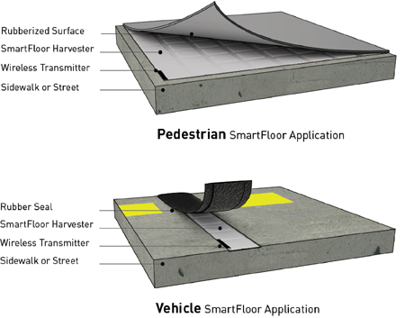

# Kinetic Walkways

**Pavegen Gen3**
Developed by Laurence Kemball-Cook Founder
- Depth of travel around **5-10mm**
- Each step generates **about 2 to 4 joules**

Being generous

Energy stored in batteries/capacitors and used for offsetting low power appliances
[Pavegen plans to power the world with footsteps - YouTube](https://www.youtube.com/watch?v=VD15-2Uriyc)
[Walking counts - City of Sydney](https://www.cityofsydney.nsw.gov.au/public-health-safety-programs/walking-counts)

Can generate power for street lighting

- Needs more widespread and carefully placed installations. Lots of strips are installed near thoroughfares but in shapes or configs that dont actually utilise them properly. 
- Tech is scaleable, each tile supports itself.
- Power from these can be stored up, and used during off time - trickle charging a battery and using them to power street lights during the night at a field or public place
- **Triangular** design to maximise generation (more load per corner)
- Uses **electromagnetism** (what about piezo?)

# Piezo Electrics
[How to Gain Energy from Pedestrians | Smart City Solutions |](https://energy-floors.com/generating-electricity-from-pedestrians/)
[Piezoelectric Floor Tiles and Harvesting Energy from Pedestrians](https://blog.piezo.com/piezoelectric-floor-tiles-and-harvesting-energy-from-pedestrians)

- More common less invasive way of generating energy from footsteps
- Low efficiency however
- Good for self powered sensors