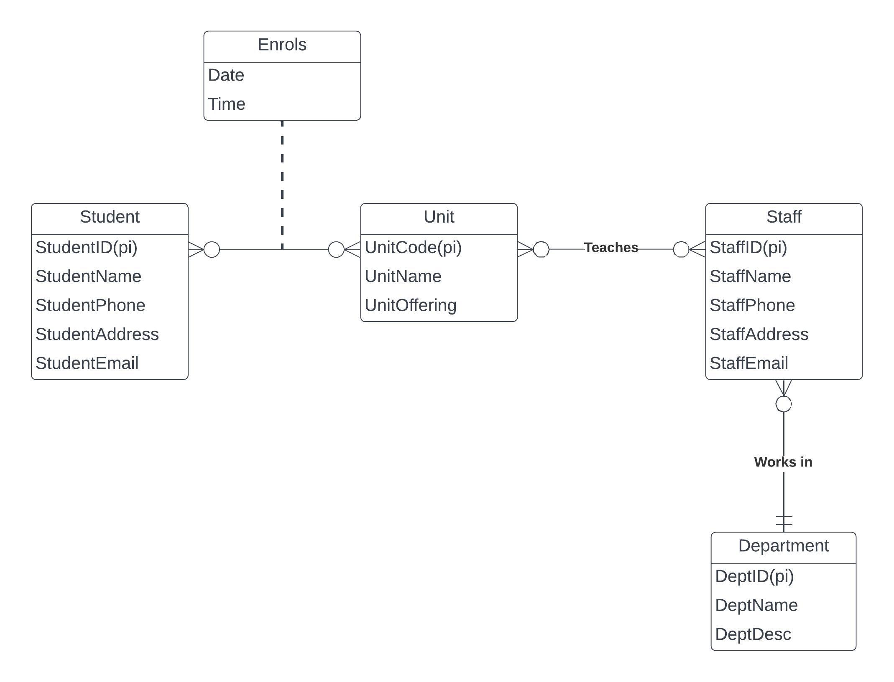

# Business Rules
 Statements that define or constrain aspects of business.
	- Derived from policies, procedures, events and functions within the organisation.
	- They assert structure and control / influence behaviour, ensuring consistency and adherence to **organisational standards**.
	- Expressed in terms familiar to end users.

1. **Declarative**: It focuses on *what* needs to be done rather than *how*.
2. **Precise**: The rule is clear and has an agreed upon meaning.
3. **Atomic**: The rule should be a single standalone statement that addresses a specific aspect of business.
4. **Consistent**: The rule is internally consistent within itself and does not conflict with other rules or policies
5. **Expressible**: Can be easily understood and expressed in natural language.
6. **Distinct**: Non-redundant, avoiding duplication or overlap with other rules.
7. **Business oriented**: Written in a manner that can be easily understood by businesspeople and stakeholders.

.md#ERD)

# Entities

**Strong Entity**
- Exists independently from other types of entites
- Has its own unique identifier, known as the primary identify
- primary identifiers

**Weak Entity**
- *Depends on a strong entity to exist*
- Does not have a primary identifier
- Existence is determined by its relationship with the owner entity.

**Associative Entities**
- AKA *relationship entities*
- Associative entities are used to represent many-to-many relationships between two or more entities.
- They contain attributes that describe the relationship itself.

## Associative Entities
An entity has attributes. A relationship links entities together
- The associative entity could have meaning independent of the other entities
- The associative entity preferably has a unique primary identifier, and should also have other attributes
- The associative entity may participate in other relationships other than the entities of the associated relationship
- Ternary relationships should be converted to associative entities

# Attributes
*Attributes are properties of the entities. These are the different types of attributes:*
1. **Required vs. Optional Attributes**
	- Required attributes must have a value for every instance of the entity or relationship.
	- Optional attributes may or may not have a value
2. **Simple-Valued vs Composite Attributes**
	- Simple attributes are atomic and cannot be broken down further
	- Composite attributes are made up of multiple sub-attributes or components
3. **Single Valued vs Multivalued Attributes**
	- Single-valued attributes can have only one value for each instance
	- Multivalued attributes can have more than one value for the same instance.
4. **Stored vs Derived Attributes**
	- Stored attributes are directly stored in the database as part of the entity or relationship.
	- Derived attributes are calculated or derived from other attributes
5. **Identifier Attributes**
	- Identifier attributes uniquely identify individual instances of an entity.
	- They serve as primary keys to ensure each entity instance is unique.

# Relationships
Modelled as lines connecting entities in an [Entity Relationship Diagram (ERD)](../../../Distilled%20Notes/Entity%20Relationship%20Diagram%20(ERD).md). They visually illustrate the associations between different entities in the database.
.png)
**Degrees of relationship**
1. **Unary Relationship**: In a unary relationship, an entity is related to itself. It occurs when an entity type has a relationship with another instance of the same entity type. *Example: Two users being friends on facebook*
2. **Binary Relationship:** A binary relationship involves two entities. It is the most common type of relationship and represents an association between instances of two distinct entity types. *For example, in a university database, the "Student" entity may have a binary relationship "Enrols In" with the "Course" entity.*
3. **Ternary Relationship**: A ternary relationship involves three or more entities. Ternary relationships are less common but can be useful when a situation involves three or more entities. *For example, in a shipping company database, a ternary relationship "Shipment" may exist among "Customer," "Product," and "Warehouse" entities, representing the shipments of products from a warehouse to a customer.*

1. **One-to-One (1:1) Relationship:** 
	- Each entity in the relationship is associated with exactly one related entity.
2. **One-to-Many (1:N) Relationship:** 
	- An entity on one side of the relationship can be associated with many related entities on the other side. 
	- Entities on the other side will have a maximum of one related entity.
3. **Many-to-Many (M: N) Relationship:** 
	- Entities on both sides of the relationship can be associated with many related entities on the other side. 
	- Each instance of one entity type can be related to multiple instances of the other entity type, and vice versa.

# Transformation Process

1. Strong entities**  
For each strong entity in the ER model, create a relation (i.e. a table that includes all the simple attributes). Make sure to identify the primary key for the relation (i.e. the PI of the entity becomes the PK of the table). If there is a composite attribute, you can expand them. Leave multi-valued attributes out (they will be dealt with later.)  
2.  Weak Entities**  
STEP 2: For each weak entity in the ER model, create a relation that includes all the simple attributes. The primary key of the relation is the combination of the primary key/s of the ‘owner’ and the main attribute of the weak entity itself.  
3. 1:1 relationship**  
For each 1 TO 1 Relationship identify the two relations corresponding to the entities participating in the relationship. Choose the PK of the Relation (usually the one with mandatory constraint) and make it as the foreign key of the other relation.  
4. 1:N relationship**
For each binary 1 TO N Relationship identify the relations that represent the participating entity at the N (i.e many) side of the relationship. Include as the foreign key in the relation that holds the N side, the primary key of the other entity (that holds the 1 side)  
6. M:N relationship**  
For each binary M:N Relationship create a new relation to represent the relationship. The primary key of the new relation is the combination of the primary keys of the two connected entities. This is an associative entity. If there are any attributes on the relationship, then include them.  

  
**Step 6: Multi-valued attributes**  
For each multivalued attribute, create a new relation that includes the multivalued attribute and the primary key of the entity where the multivalued attribute is attached.

**Step 7: Associative entities**  
For each ternary relationship create a new relation to represent the relationship. The primary key of the new relation is the combination of the primary keys of the participating entities that hold the N (many) side. In most cases of an ternary relationship, all the participating entities hold a many side.  

**Final Table List**  
Use the updated version of all tables and combine them to get the result. Take the most up-to-date version of each table. A useful habit is to cross out any tables if you create an updated version of it.

*Step 1: Strong Entities*
- Student (**StudentID(PK)**, StudentName, StudentPhone, StudentAddress, StudentEmail)
- Unit (**UnitCode(PK)**, UnitName, UnitOffering)
- Staff (**StaffID(PK),** StaffName, StaffPhone, StaffAddress, StaffEmail)
- Department (**DeptID(PK)**, DeptName, DeptDesc)

*Step 2: Weak Entities*
There are no weak entities.

*Step 3: One to one relationships*
There are no one to one relationships.

*Step 4: One to many relationships*
- Staff (**StaffID (PK)**, StaffName, StaffPhone, StaffAddress, StaffEmail, DepartmentID (FK))

*Step 5: Many to many relationships*
- Enrolls(**StudentID (PK, FK)**, UnitCode (PK, FK), Date, Time)
- Teaches(**StaffID (PK, FK)**, UnitCode (PK, FK))

*Step 6: MVA*
 There are no multi-valued attributes.

*Step 7: Ternary relationships*
 There are no ternary relationships.

# SQL