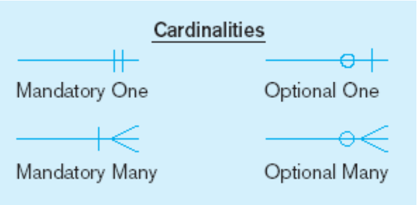

**[Lecture Questions](Attachments/Week%202_inClassPrintout(1).docx)**
[Lecture Notes](Attachments/Week%202%20(ER%20Diagrams).pdf)

# Business Rules
- Statements that define or constrain aspects of business.
	- Derived from policies, procedures, events and functions within the organisation.
	- They assert structure and control / influence behaviour, ensuring consistency and adherence to **organisational standards**.
	- Expressed in terms familiar to end users
- Using a [[Database Management System]] (DMS) software, Business Rules can be automated
	- Ensures data quality
- Critical to maintaining data quality, enforcing policies, streamlining business processes.
- Usually used to inform the structure of a businesses database
## Characteristics of Business Rules
 - **Description**: Business rules describe policies procedures or principles within a specific organisation. Defines what actions are acceptable or not
- **Applicability**: Rules apply to any organisation that stores and uses data to generate information.
- **Example**: A business rule could be: "A pilot should not fly more than 14 hours a day". which describes an operation to create and enforce an action within an organization's environment.
- **Documentation**: Business rules must be in writing and kept up to date.


They should have the following characteristics:

1. **Declarative**: It focuses on *what* needs to be done rather than *how*.
2. **Precise**: The rule is clear and has an agreed upon meaning.
3. **Atomic**: The rule should be a single standalone statement that addresses a specific aspect of business.
4. **Consistent**: The rule is internally consistent within itself and does not conflict with other rules or policies
5. **Expressible**: Can be easily understood and expressed in natural language.
6. **Distinct**: Non-redundant, avoiding duplication or overlap with other rules.
7. **Business oriented**: Written in a manner that can be easily understood by businesspeople and stakeholders.


# Database Modelling - 3 phases

```ad-note
title: Conceptual Data Modelling
- Initial phase of database design process
- Create a high level and abstract representation of the database. 
- Aims to understand and capture the data requirements of the application
- Often represented using an [[Entity Relationship Diagram (ERD)]] or an [[Enhanced Entity Relationship Diagram (EERD)]] 
```

```ad-important
title: Logical Data Modelling
- Transforming the high level and abstract representation of the database from the conceptual model into more detailed and implementation-independent structure.
- entities identified in the conceptual model are transformed into tables, and each table represents a specific entity.
- Attributes of the entities become the columns of the corresponding tables.
- The relationships between entities are translated into data integrity constraints, such as primary keys, foreign keys, and other constraints that ensure data consistency and integrity.

```

```ad-error
title: Physical Data Modelling
 - involves transforming the logical model into a specific implementation that is optimized for the chosen [Database Management System](../../../Distilled%20Notes/Database%20Management%20System.md)
 - The logical model's data types and constraints are mapped to the specific data types and constraints supported by the chosen DBMS
 - This ensures compatibility and data integrity during the implementation. The physical model considers performance optimization techniques, such as data caching, query optimization, and database tuning, to ensure efficient data access and processing.

```


# Entities

**Strong Entity**
- Exists independently from other types of entites
- Has its own unique identifier, known as the primary identify
- primary identifiers

**Weak Entity**
- *Depends on a strong entity to exist*
- Does not have a primary identifier
- Existence is determined by its relationship with the owner entity.

**Associative Entities**
- AKA *relationship entities*
- Associative entities are used to represent many-to-many relationships between two or more entities.
- They contain attributes that describe the relationship itself.

## Associative Entities
**When should a relationship with attributes instead be an associative entity?**  

- An entity has attributes. A relationship links entities together
- The associative entity could have meaning independent of the other entities
- The associative entity preferably has a unique primary identifier, and should also have other attributes
- The associative entity may participate in other relationships other than the entities of the associated relationship
- Ternary relationships should be converted to associative entities

# Attributes
They allow for the detailed representation of information and support various operations, such as querying, updating, and organizing data in the database.
**They represent the specific data that is stored for each instance of an entity or relationship.**

*Attributes are properties of the entities. These are the different types of attributes:*

1. **Required vs. Optional Attributes**
	- Required attributes must have a value for every instance of the entity or relationship.
	- Optional attributes may or may not have a value
2. **Simple-Valued vs Composite Attributes**
	- Simple attributes are atomic and cannot be broken down further
	- Composite attributes are made up of multiple sub-attributes or components
3. **Single Valued vs Multivalued Attributes**
	- Single-valued attributes can have only one value for each instance
	- Multivalued attributes can have more than one value for the same instance.
4. **Stored vs Derived Attributes**
	- Stored attributes are directly stored in the database as part of the entity or relationship.
	- Derived attributes are calculated or derived from other attributes
5. **Identifier Attributes**
	- Identifier attributes uniquely identify individual instances of an entity.
	- They serve as primary keys to ensure each entity instance is unique.


## Choosing Identifiers
When choosing **identifiers** for entities in a database its essential to consider the following suggestions:
1. **Stability**: Select identifiers that will not change in value over time.
2. **Non-Null**: Ensure that the chosen identifier attributes always have a value for every instance of the entity.
3. **Avoid intelligent identifiers**: Intelligent identifiers are things like location names or people's names. Instead, opt for generic, descriptive, and non-sensitive identifiers.
4. **Simplicity**: Prefer simple and straightforward identifiers over complex and composite keys.
5. **Substitute long composite keys**: When possible, replace long, composite keys (keys made up of multiple attributes) with single, simple keys.

## Naming Conventions
1. **Singular Noun or Noun Phrase**: Attribute names should be in the form of a singular noun or a noun phrase that describes the property or characteristics of the entity or relationship.
2. **Unique Names**: Each attribute name should be unique within the entity or relationship to avoid confusion
3. **Standard format**: Follow a consistent and standardized naming convention for attributes. One common convention is to use the CamelCase format, example "EntityName | AttributeName" to indicate entity and attribute. It is ok to shorten attributes.

# Relationship
Modelled as lines connecting entities in an [Entity Relationship Diagram (ERD)](../../../Distilled%20Notes/Entity%20Relationship%20Diagram%20(ERD).md). They visually illustrate the associations between different entities in the database.
.png)
**Degrees of relationship**
1. **Unary Relationship**: In a unary relationship, an entity is related to itself. It occurs when an entity type has a relationship with another instance of the same entity type. *Example: Two users being friends on facebook*
2. **Binary Relationship:** A binary relationship involves two entities. It is the most common type of relationship and represents an association between instances of two distinct entity types. *For example, in a university database, the "Student" entity may have a binary relationship "Enrols In" with the "Course" entity.*
3. **Ternary Relationship**: A ternary relationship involves three or more entities. Ternary relationships are less common but can be useful when a situation involves three or more entities. *For example, in a shipping company database, a ternary relationship "Shipment" may exist among "Customer," "Product," and "Warehouse" entities, representing the shipments of products from a warehouse to a customer.*


There are several types of relationships that describe how entities are connected to each other  

1. **One-to-One (1:1) Relationship:** 
	- Each entity in the relationship is associated with exactly one related entity.
    
2. **One-to-Many (1:N) Relationship:** 
	- An entity on one side of the relationship can be associated with many related entities on the other side. 
	- Entities on the other side will have a maximum of one related entity.
    
3. **Many-to-Many (M: N) Relationship:** 
	- Entities on both sides of the relationship can be associated with many related entities on the other side. 
	- Each instance of one entity type can be related to multiple instances of the other entity type, and vice versa.

# Cardinality and Constraints
- **Cardinality** refers to the *maximum* number of related instances that an entity can have in a relationship.
	- It can be one-to-one (1:1), one-to-many (1:N) or many-to-many (M:N)
- **Constraints** refer to the *minimum* number of related instances that an entity must have in a relationship.
	- It can be **zero (optional)** or **one (mandatory)**



