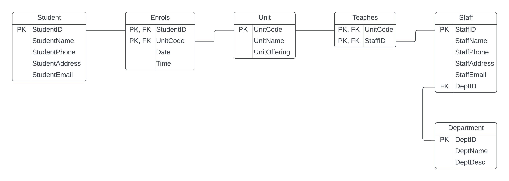

[In Class Printout](Attachments/Week%205_inClassPrintout.docx)
[ER Diagrams](Attachments/Lecture%202%20(contd)-%20ER%20Diagrams%201.pdf)

**Types of languages**
1. Structured Query Language (SQL)
2. Data Definition Language (DDL)
3. Data Manufacturing Language (DML)
4. Data Querying Language (DQL)
%201.png)
# SQL
Structured Query Language (SQL) is a standardized language originally designed as a relational database query tool.
Currently used in many software products to retrieve and update data – E.g., MySQL, SQL Developer, Snowflake.

## Data Types
- The data type of a column defines the value a column can hold
- Each column in a database table is required to have a name and a data type.
- The data type is a guideline for SQL to understand what type of data is expected inside of each column
- SQL developer (YOU) must decide Data Type

| DataType           | Example      | Display    |
| ------------------ | ------------ | ---------- |
| INT                | INT          | 12345678   |
| DECIMAL(size, dec) | DECIMAL(8,2) | 123456.22  |
| CHAR(size)         | CHAR(8)      | ALAVI      |
| VARCHAR            | VARCHAR(8)   | ALAVI      |
| DATE (YYYY-MM-DD)  | DATE         | 2022-08-27 |
More SQL data types can be found [here](https://www.w3schools.com/sql/sql_datatypes.asp).

# SQL Servers: ASH vs Local
|                    | Ash Server                                                                                                                                  | Local                                                                                               |
| ------------------ | ------------------------------------------------------------------------------------------------------------------------------------------- | --------------------------------------------------------------------------------------------------- |
| Connecting         | Server is already set up. Follow guides for connecting.                                                                                     | Must be installed onto device. Follow guides for installation.                                      |
| Can create schema? | No. Each connection to the ash server is only allowed 1 schema. The schema will be named as your **studentID**.                             | Can create as many schemas. Need to use 'create schema **_schemaName_**' and 'use **_schemaName_**' |
| Case sensitive?    | Yes **table** names are case sensitive. Be very careful during Create Table phase.      Column names and data are not case sensitive. | Not case sensitive.                                                                                 |
| Reliable?          | For the most part, yes. But can become problematic nearing assignment submission dates when many students are connected.                    | No down time.                                                                                       |

# ERD to Schema Example

*Step 1: Strong Entities*
- Student (**StudentID(PK)**, StudentName, StudentPhone, StudentAddress, StudentEmail)
- Unit (**UnitCode(PK)**, UnitName, UnitOffering)
- Staff (**StaffID(PK),** StaffName, StaffPhone, StaffAddress, StaffEmail)
- Department (**DeptID(PK)**, DeptName, DeptDesc)

*Step 2: Weak Entities*
There are no weak entities.

*Step 3: One to one relationships*
There are no one to one relationships.

*Step 4: One to many relationships*
- Staff (**StaffID (PK)**, StaffName, StaffPhone, StaffAddress, StaffEmail, DepartmentID (FK))

*Step 5: Many to many relationships*
- Enrolls(**StudentID (PK, FK)**, UnitCode (PK, FK), Date, Time)
- Teaches(**StaffID (PK, FK)**, UnitCode (PK, FK))

*Step 6: MVA*
 There are no multi-valued attributes.

*Step 7: Ternary relationships*
 There are no ternary relationships.

  
*Final Tables*  
- Student (**StudentID(PK),** StudentName, StudentPhone, StudentAddress, StudentEmail)
- Unit (**UnitCode(PK)**, UnitName, UnitOffering)
- Department (**DeptID(PK)**, DeptName, DeptDesc)
- Staff (**StaffID(PK),** StaffName, StaffPhone, StaffAddress, StaffEmail, *DepartmentID(FK)*)
- Enrols (***StudentID(PK, FK)***, ***UnitCode(PK, FK)***, Date, Time)
- Teaches(***StaffID(PK, FK),*** ***UnitCode(PK, FK))***

