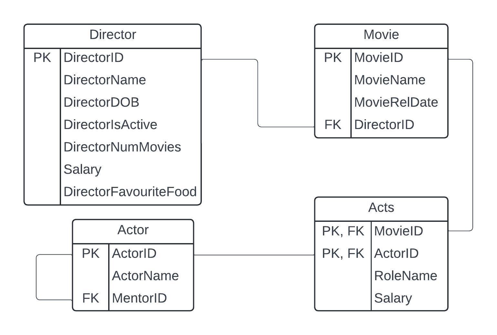

# Data Languages

## DDL and DML

| Data Definition Language (DDL)             | Data Manipulation Language (DML)     | Data Querying Language (DQL) |
| ------------------------------------------ | ------------------------------------ | ---------------------------- |
| Determine the database and table structure | Manage the data (records) of a table | Retrieve and interpret data  |
| CREATE, DROP, ALTER, TRUNCATE              | INSERT, DELETE, UPDATE               | SELECT, FROM, WHERE, ORDER   |
# Data Querying Language (DQL)

Note:
- <> pairs are to indicate optional elements and not to be used in actual SQL statements
Run **[this](https://ilearn.mq.edu.au/pluginfile.php/9303122/mod_book/chapter/351312/week6_script.sql "this")** script to create the IMDB schema. 

### Examples
**Display a list of director's salaries.**

SELECT Salary  
FROM Director  
**;**

**Display all directors' info showing the director with the least number of movies produced first. If more than one director produced the same number of movies, show the director getting the most salary first.  
**

SELECT *  
FROM Director  
**ORDER BY** DirectorNumMovies, Salary DESC  
**;**

**Display the directors' name, date of birth, and salary, but only show those who are still actively producing movies.  
**

SELECT DirectorName, DirectorDOB, Salary  
FROM Director  
**WHERE** DirectorIsActive = TRUE  
**;**


## The SELECT clause
```ad-danger
title: SELECT clause

**SELECT column-name <, column-name...>  
FROM table-name**  
<**WHERE** criteria>  
<**GROUP BY** column-name <, column-name...>>  
<**HAVING** aggregate-criteria>  
<**ORDER BY** column-name <ASC | DESC> <, column-name <ASC | DESC>...>>  
**;**
```

The **SELECT** clause is where the selection of columns is provided.

Options:
- * for all columns available  
    SELECT *  
    FROM Director  
    ;  
    
- one column name  
    SELECT DirectorID  
    FROM Director  
    ;  
    
- multiple column names separated with commas  
    SELECT DirectorID, DirectorName, DirectorDOB  
    FROM Director  
    ;  

*The **DISTINCT** keyword can be used to eliminate repeating rows of results (duplicate results).*

SELECT DISTINCT DirectorFavouriteFood  
FROM Director  
;

*The **AS** keyword can be used to create an alias for the column name, which will be displayed in the query result instead of the original column name.*

SELECT DirectorName **AS** Name, DirectorIsActive **AS** Status  
FROM Director  
;

## The FROM clause
```ad-summary
title: FROM clause

**SELECT column-name <, column-name...>  
FROM table-name**  
<**WHERE** criteria>  
<**GROUP BY** column-name <, column-name...>>  
<**HAVING** aggregate-criteria>  
<**ORDER BY** column-name <ASC | DESC> <, column-name <ASC | DESC>...>>  
**;**
```

*The **FROM** clause is where the selection of source tables is provided.*

Options:
- single table  
    SELECT *  
    **FROM** Director  
    ;  
    
- multiple tables  
    SELECT *  
    **FROM** Director, Movie  
    ;  
    
- multiple tables with JOIN clause  
    SELECT *  
    **FROM** Director JOIN Movie ON Director.DirectorID = Movie.DirectorID  
    ;  
    

*The **AS** keyword can be used to create an alias for the table name, which then can be used in the query instead of the original table name.*

SELECT *  
**FROM** Director AS d JOIN Movie AS m ON d.DirectorID = m.DirectorID  
;

## The WHERE clause
```ad-important
title: WHERE clause

**SELECT column-name <, column-name...>  
FROM table-name**  
<**WHERE** criteria>  
<**GROUP BY** column-name <, column-name...>>  
<**HAVING** aggregate-criteria>  
<**ORDER BY** column-name <ASC | DESC> <, column-name <ASC | DESC>...>>  
**;**
```

*The **WHERE** clause is an optional clause that can be used to provide record selection criteria or filtering mechanisms.*

Depending on the data type contained in the column the behaviour may differ. The commonly used operators in the criteria are:

- **=** for equal to (exact match)
- **<>** or **!=** for not equal to  
- **>** for greater than (exclusive) or **>=** for greater than or equal to (inclusive)   
- **<** for less than (exclusive) or **<=** for less than or equal to (inclusive)  
        
- ***LIKE** for pattern matching for string type columns using operators '%' and/or ''*  
    
    - Sample for matching strings beginning with the letter 'A' of any length  
        SELECT *  
        FROM Director  
        **WHERE** DirectorName LIKE 'A%'  
        ;  
        
    - Sample for matching strings ending with the string 'nt' of any length  
        SELECT *  
        FROM Director  
        **WHERE** DirectorName LIKE '%nt'  
        ;  
        
    - Sample for matching strings with a length of 5 characters  
        SELECT *  
        FROM Director  
        **WHERE** DirectorName LIKE  ``` '_____' ```  
        ;  
        
    - Sample for matching strings containing a space anywhere and of any length  
        SELECT *  
        FROM Director  
        **WHERE** DirectorName LIKE '% %'  
        ;  
        
    - Sample for matching strings with the letter 'a' in the second character of any length  
        SELECT *  
        FROM Director  
        **WHERE** DirectorName LIKE '_a%'  
        ;  
        
- **BETWEEN** for values between a range (inclusive)
    - Sample for string/date column (VARCHAR, CHAR, DATE, etc.)  
        SELECT *  
        FROM Director  
        **WHERE** DirectorDOB BETWEEN '1970-01-01' AND '1985-12-31'  
        ;  
        
    - Sample for numeric column (INT, DECIMAL, etc.)  
        SELECT *  
        FROM Director  
        **WHERE** DirectorNumMovies BETWEEN 5 AND 20  
        ;  
        
- **IN** for equal to one of the possible values listed
    - Sample for string/date column (VARCHAR, CHAR, DATE, etc.)  
        SELECT *  
        FROM Director  
        **WHERE** DirectorID IN ('D1', 'D5', 'D6')  
        ;  
        
    - Sample for numeric column (INT, DECIMAL, etc.)  
        SELECT *  
        FROM Director  
        **WHERE** DirectorNumMovies IN (4, 8, 12)  
        ;

### Multiple Criteria
```ad-bug
title: WHERE Multiple criteria

**SELECT column-name <, column-name...>  
FROM table-name**  
<**WHERE** criteria>  
<**GROUP BY** column-name <, column-name...>>  
<**HAVING** aggregate-criteria>  
<**ORDER BY** column-name <ASC | DESC> <, column-name <ASC | DESC>...>>  
**;**
```

  

The **WHERE** clause can be used to provide multiple criteria by using the operators: AND, OR, or NOT

- **AND** for ensuring that all conditions are fulfilled
    - Display directors' info who had produced at least 10 movies, but earned less than 200  
        SELECT *  
        FROM Director  
        **WHERE** DirectorNumMovies >= 10 **AND** Salary < 200  
        ;  
        
    - Display directors' info whose name starts with the letter A, had produced more than 5 movies, and are still active  
        SELECT *  
        FROM Director  
        **WHERE** DirectorName LIKE 'A%' **AND** DirectorNumMovies > 5 **AND** DirectorIsActive = true  
        ;  
        
- **OR** for fulfilling at least one of the conditions  
    - Display high achiever directors. A producer is deemed to be a high achiever if they have directed 25 movies or more, otherwise one that earned more than 500  
        SELECT *  
        FROM Director  
        **WHERE** DirectorNumMovies > 5 **OR** Salary > 500  
        ;  
        
    - Display directors who like Korean food, chicken, or lasagne  
        SELECT *  
        FROM Director  
        **WHERE** DirectorFavouriteFood LIKE '*korean* **OR** DirectorFavouriteFood LIKE '*chicken* **OR** DirectorFavouriteFood LIKE '*lasagne*  
        ;  
        
- **NOT** for excluding results that fulfilled the condition   
    - Display directors who are not active  
        SELECT *  
        FROM Director  
        **WHERE** **NOT** DirectorIsActive = true  
        ;  
        
    - Display directors who dislike chicken  
        SELECT *  
        FROM Director  
        **WHERE** DirectorFavouriteFood **NOT** LIKE '%chicken%'  
        ;  
        
- Nested criteria using a set of **()**
    

- Display directors with names starting with A or R, who is still active  
    SELECT *  
    FROM Director  
    **WHERE** **(**DirectorName LIKE 'A%' **OR** DirectorName LIKE 'R%'**)** **AND** DirectorIsActive = true  
    ;

## ORDER BY clause
```ad-note
title: ORDER BY

**SELECT column-name <, column-name...>  
FROM table-name**  
<**WHERE** criteria>  
<**GROUP BY** column-name <, column-name...>>  
<**HAVING** aggregate-criteria>  
<**ORDER BY** column-name <ASC | DESC> <, column-name <ASC | DESC>...>>  
**;**
```

The **ORDER BY** clause can be used to sort the records in ascending (A to Z or lower to higher) or descending (Z to A or higher to lower) order. If ascending or descending is not specified, the default is ascending order.

- sorting based on a single column using the default order
    - Display directors' info showing the directors' names in alphabetical order.  
        SELECT *  
        FROM Director  
        **ORDER BY** DirectorName  
        ;  
        
- sorting based on a single column using explicitly specified order
    - Display directors' info starting with those with the most movies directed.  
        
        SELECT *  
        FROM Director  
        **ORDER BY** DirectorNumMovies DESC  
        ;  
        
- sorting based on multiple columns using the default order

- Display directors showing the lowest salary first, then based on the earliest date of birth.  
    SELECT *  
    FROM Director  
    **ORDER BY** Salary, DirectorDOB  
    ;  
    

- sorting based on multiple columns using explicitly specified order   
    - Display directors who are active first, then based on their names in alphabetical order.  
        SELECT *  
        FROM Director  
        **ORDER BY** DirectorIsActive DESC, DirectorName ASC   
        ;

# Functions - Non-aggregate
There are two types of SQL functions: 

1. **non-aggregate functions**  
    These are functions that operate on individual values only (a single record).
2. **aggregate functions**  
    These are functions that operate on multiple records and create a summary.

This week, the focus is on non-aggregate functions only.

A few commonly used non-aggregate functions:

## Numeric functions

- **ROUND**(number <, decimal>) - round the number to the nearest specified decimal places (if the decimal is not specified, the default is 0 decimal places)  
        Examples: 
	- ROUND(Salary)
	- ROUND(Salary, 1)
- **FLOOR**(number) - round down the number to the nearest whole number   
        Example:  
	- FLOOR(Salary)
- **CEILING**(number) - round up the number to the nearest whole number  
        Example:  
	- CEILING(Salary)
- **ABS**(number) - extract the absolute number (disregard positive or negative)  
        Example:  
    - ABS(DirectorNumMovies-10)  

## String functions
 
- **CONCAT**(string1, string2 <, string3...>) - combine multiple strings together  
        Example: 
	- CONCAT("$ ", Salary, " thousands")
- **UPPER**(string) - convert the string to all uppercase  
        Example:
	- UPPER(DirectorName)
- **LOWER**(string) - convert the string to all lowercase  
        Example:
	- LOWER(DirectorName)
- **TRIM**(string) - trim any leading and trailing whitespace  
        Example:
	- TRIM(DirectorName)
- **LENGTH**(string) - get the length of the string  
        Example:
	- LENGTH(DirectorName)
- **LEFT**(string, number-of-characters) - grab the string from the first character for the specified number of characters  
        Example:
	- LEFT(DirectorName, 3)
- **RIGHT**(string, number-of-characters) - grab the string from the last character for the specified number of characters  
        Example:
	- RIGHT(DirectorName, 5)
-  **MID**(string, start, number-of-characters) - grab the string from the specified start position for the specified number of characters  
        Example:
	- MID(DirectorName, 5, 4)
        
          
        
## Date functions
- **NOW**() - provide the current date and time
- **CURDATE**() - provide the current date
- **DAY**(date) - extract the day of a date  
        Example:
	- DAY(DirectorDOB)
- **MONTH**(date) - extract the month of a date  
        Example:  
	- MONTH(CURDATE())
- **YEAR**(date) - extract the year of a date  
        Example:  
	- YEAR(NOW())
- **DATEDIFF**(date1, date2) - the number of days between the two dates (date1 - date2)  
        Example:  
	- DATEDIFF(CURDATE(), DirectorDOB)
- **DATE_FORMAT**(date, format)  
        Example:  
	- DATE_FORMAT(DirectorDOB, '%D of %M, %Y')

*More functions information is available at [MySQL Functions](https://www.w3schools.com/mysql/mysql_ref_functions.asp)*

Sample usage in queries:
- Display the names of the directors with the names of the day they were born.  
    **SELECT** DirectorName, **DATE_FORMAT**(DirectorDOB, '%W')  
    **FROM** Director  
    ;  
    
- Display the names of the directors with their birth year in a sentence.  
    **SELECT CONCAT**(DirectorName, ' was born in ', **YEAR**(DirectorDOB))  
    **FROM** Director  
    ;  
      
- Display the directors who were born between the years 1950 and 1975  
    **SELECT** *  
    **FROM** Director  
    **WHERE** **YEAR**(DirectorDOB) BETWEEN 1950 AND 1975  
    ;

# Data Definition Language
Schema for the examples:


#### DDL - Foreign Key constraint

**Syntax to create a table (CREATE statement)  
**

**CREATE TABLE** table-name (  
    column-name1 column-definition1,  
    column-name2 column-definition2,
    ... ,
    <**PRIMARY KEY**(column-name <, column-name…>),>
    <**FOREIGN KEY**(column-name <, column-name…>) 
        **REFERENCES** source-table-name(column-name <, column-name…>)>)
;
**Notes:**
- Column referencing another column must have the same data type and length.  
- If data has been added before adding the foreign key, all values in the column must have a relevant reference in the source table.


## Query using multiple tables
