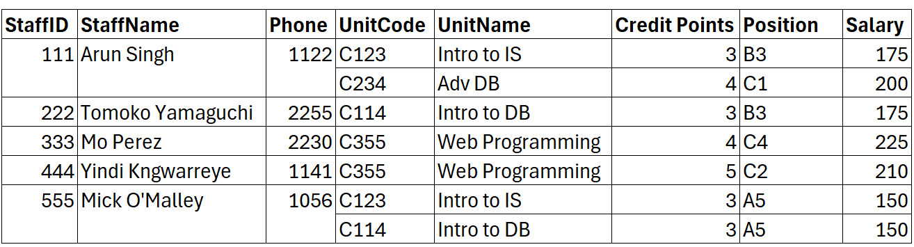
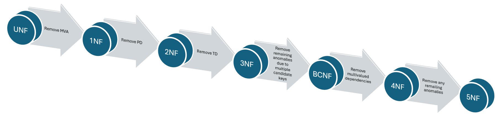
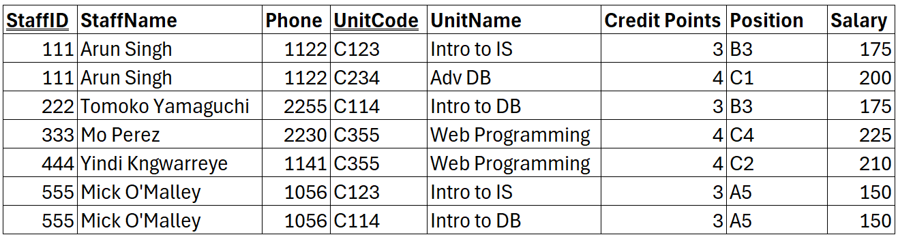
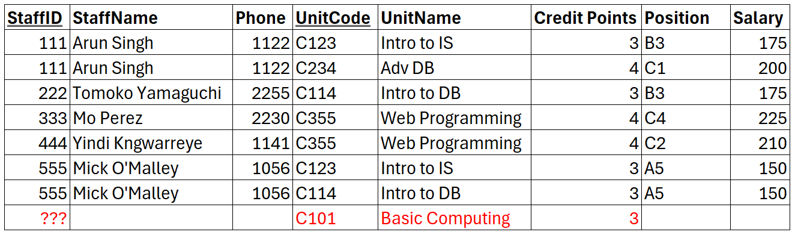
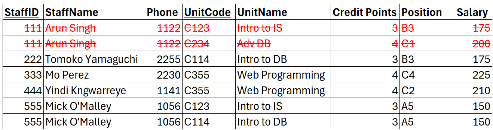
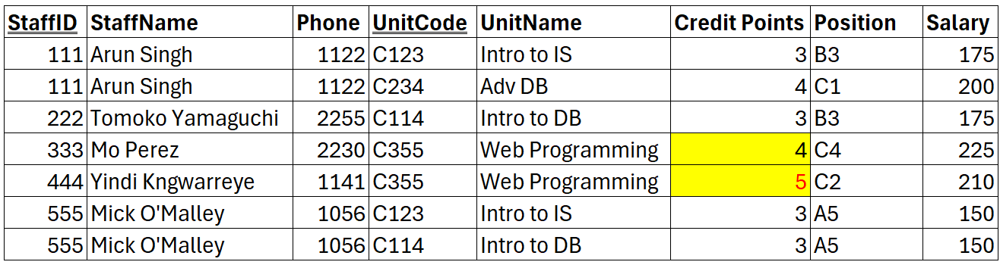
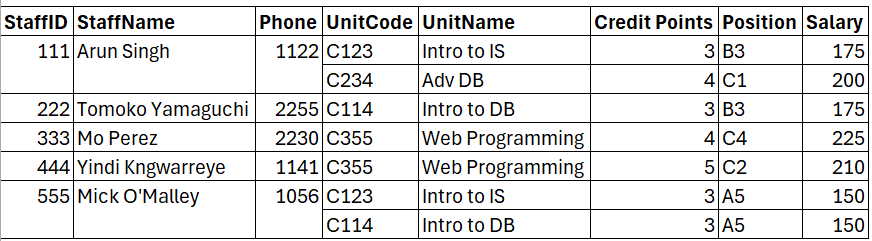

Training dataset:

Normalisation is a process to validate and improve a logical design to minimise or even avoid unnecessary duplication of data.
It can also be used as a bottom-up approach to create a database from an existing data set.

The goals:
- to avoid anomalies due to insertion, deletion, and modification/update.
- to make the database design more intuitive to users.
- to minimise database redesign even when the database is expanded to include new entities or attributes.

# Anomalies

There are three types of possible anomalies in a database:

- insertion anomaly - adding new rows forces the creation of duplicate data
- deletion anomaly - deleting rows may cause a loss of data that would be needed for other future rows  
- modification/update anomaly - changing data in a row forces changes to other rows because of duplication

  

## Example

The primary key is a composite of StaffID and UnitCode.

  

### Insertion Anomaly

If a new unit is introduced, a staff must be entered since it is a part of the primary key. So, we cannot add information about a new unit without hiring an employee first and assigning them to the unit.

  

### Deletion Anomaly

If the only employee assigned to a unit has been removed, we lose the unit information, since removing the unit code alone is not possible.

  

### Modification/Update Anomaly

If we need to modify the credit points for a unit, it may cause data inconsistency due to the redundant data, unless it applies to all instances of that data.

# Functional Dependency

**Functional dependency** represents the relationship between attributes in a relation, where one or a set of attributes act as the **determinant** for other attributes (the **dependents**).

We can note dependency as a notation or in a diagram.

- A is the determinant and B is the dependent; OR B is functionally dependent on A  
    - Dependency notation: A → B
    - Dependency diagram  
      
- A and B are the determinants and C, D and E are the dependents; OR C, D, and E are functionally dependent on both A and B
    - Dependency notation: A, B → C, D, E
    - Dependency diagram   
        %202.png)  
        

## Functional Dependency Types

1. Full functional dependency (FFD) - attributes that are dependent on all parts of the key
2. Partial dependency (PD) - attributes that are dependent on a part of the key
3. Transitive dependency (TD) - attributes that are dependent on another non-key attribute(s)

#### Example
The primary key is a composite of StaffID and UnitCode, so initially, all other attributes depend on both the StaffID and UnitCode.

However, considering the composite key, only the Position and Salary attributes are fully dependant on all parts of the composite key.

StaffName and Phone are only dependent on the StaffID (part of the composite key), so it is only partially dependent on the composite key. Similarly, UnitName and CreditPoints are only dependent on the UnitCode (part of the composite key), so partial dependents, too.

Furthermore, checking on the non-keys attributes (not part of the composite key), the Salary is dependent on the Position, which is a transitive dependency.

# Normalisation Process

Though it is possible to the fifth normal form (5NF), even to the sixth normal form (6NF), we will only learn up to the third normal form (3NF) in this unit.
The process of normalisation must be done one normal form at a time before progressing to the next one.

## Unnormalised Form (UNF)
- At least one multivalued attribute still exists

**Example**
A few staff has been allocated to multiple units, causing multivalued attributes

##### First Normal Form (1NF)
- No multivalued attribute(s)
- Has a primary key
- At least one partial dependency still exists

**Example**
To solve the multivalued attributes, create separate rows for each.  
Assign a primary key for this relation, which is the composite attributes of StaffID and UnitCode.
There are partial dependents (PD1 and PD2) exist (refer to the dependency diagram in the [previous section](https://ilearn.mq.edu.au/mod/book/view.php?id=8447508&chapterid=355660))