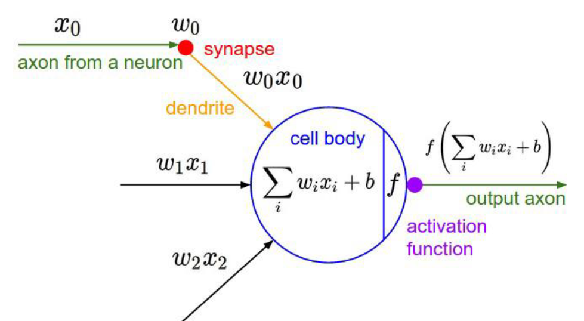
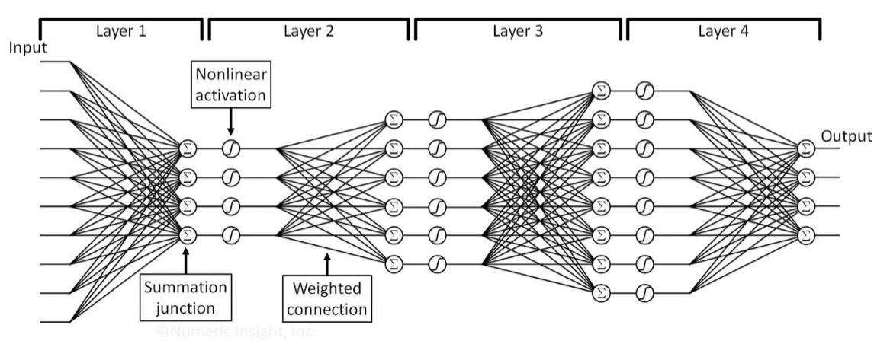

# Artificial Neural Networks

## Basics

**Artificial Neuron**
Activation function on weighted sum of inputs

We can stack these neurons up to form a neural network
- Many different network topologies.
- Many different types of activation function.

## NN Layers
- **Input layer**
	- Determined by input features, usually one unit for one feature
- **Output layer**
	- Determined by output results
	- E.g., one unit for regression, multiple for classification
- **Hidden Layer(s)**
	- Determined by users
	- Number of layers
	- Number of units in each layer
	- How to connect units
	- Which activation function to use.

**Biological Neuron and Artificial Neural Networks**

- Biological neurons: process information through electrical and chemical signals
- Artificial neural networks (ANNs): computer systems that mimic biological neurons, used for machine learning

**Three Basic Layers of AnNs**

1. **Input Layer**: receives input data
2. **Hidden Layer**: processes inputs through activation functions and weights/biases
3. **Output Layer**: produces final output based on hidden layer outputs

**Different Types of Neural Networks**

- Feedforward networks: data flows only in one direction (input -> hidden -> output)
- Recurrent neural networks (RNNs): data can flow back and forth through loops or cycles
- Convolutional neural networks (CNNs): designed for image/video processing, use convolutional layers

**Relationships to Other ML Models**

- MLPClassifier is a type of feedforward network with multiple hidden layers
- Other ANN architectures are used in different domains (e.g., RNNs for speech recognition)

**Feed Forward Neural Networks and MLP**

- Feed forward networks: data flows only in one direction, no feedback loops
- Multi-Layer Perceptron (MLP): a type of feedforward network with multiple hidden layers

**Different Activation Functions and Cost Functions**

- **Activation functions**:
    - Sigmoid: maps input to output between 0 and 1
    - ReLU (Rectified Linear Unit): outputs positive value or zero
    - Tanh (Hyperbolic Tangent): similar to sigmoid but with different range
- **Cost functions**:
    - Mean Squared Error (MSE)
    - Cross-Entropy Loss

**Gradient Descent and Derivative Chain Rule**

- Gradient descent: optimization algorithm that minimizes cost function by adjusting weights/biases
- Derivative chain rule: used to compute gradients of complex functions, essential for gradient descent

**Error Back Propagation**

- Error back propagation: computes errors between predicted output and actual output using derivatives
- Used in neural networks to optimize performance

**Overfitting Issue and Countermeasures**

- Overfitting: when model performs well on training data but poorly on new data
- Countermeasures:
    - Regularization (e.g., L2 regularization)
    - Early stopping (stops training when validation score plateaus)

Important Equations and Data:

1. **Activation functions**:
    - Sigmoid(x) = 1 / (1 + exp(-x))
    - ReLU(x) = max(0, x)
    - Tanh(x) = 2 * sigmoid(-x) - 1
2. **Cost functions**:
    - MSE(y_true, y_pred) = ((y_true - y_pred)^2).mean()
3. **Gradient descent update rule**:
    - W_new = W_old - α * dL/dW

Examples:

1. [Code] `from sklearn.neural_network import MLPClassifier` ( imports the MLPClassifier class)
2. [Example] A neural network with two hidden layers: `[Input Layer, Hidden Layer 1, Hidden Layer 2, Output Layer]`
3. [Example] An activation function used in a neuron: `sigmoid(x) = 1 / (1 + exp(-x))`