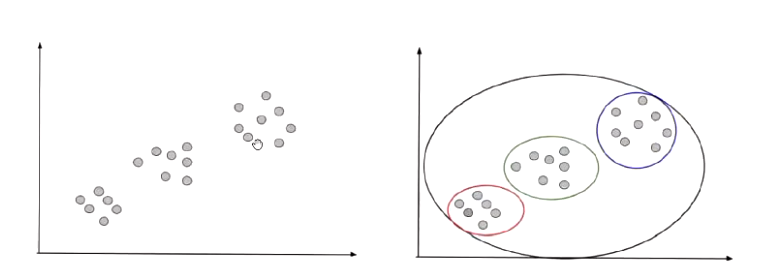
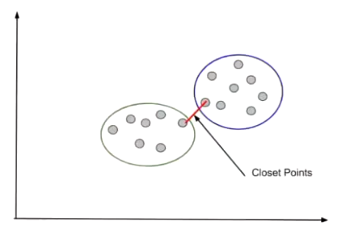
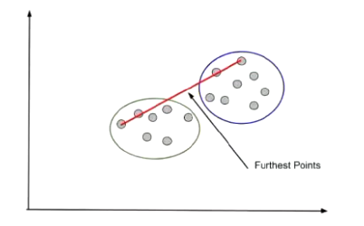
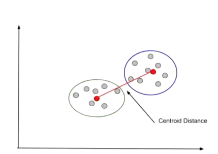

**[Lecture Slides](Lecture%20Week%207.pdf)**

## Euclidian Distance
![[../../../../Distilled Notes/Euclidean Distance]]

### Normalisation
![[../../../../Distilled Notes/Normalisation or Normalization]]

# Distance Metrics

In clustering, distance metrics are used to measure the similarity between data points. The most common distance metrics are:

- Euclidean Distance: Measures the straight-line distance between two points in n-dimensional space
- Manhattan Distance: Measures the sum of absolute differences between corresponding coordinates
- Cosine Similarity: Measures the cosine of the angle between two vectors

# Unsupervised Learning

Unsupervised learning is a type of machine learning where no labeled data is available, and the algorithm discovers patterns or relationships in the data on its own.
# Data Normalization

Data normalization is a technique used to scale numerical data to have similar magnitudes, which can improve clustering performance. Common methods for normalizing data include:

- Min-Max Scaling: Scales values to be between 0 and 1
- Standardization: Subtracts the mean and divides by the standard deviation
- Log Transformation: Applies a logarithmic transformation to stabilize variance
# Clustering

Clustering is a type of unsupervised learning that groups similar objects into clusters based on their features. The goal of clustering is to partition the data into disjoint subsets such that:

- Samples within a cluster are similar (high intraclass similarity)
- Samples in different clusters are different (low interclass similarity)

## KMeans Clustering

K-means clustering is an algorithm for unsupervised learning that partitions the data into k clusters based on their mean features. The basic steps of K-means clustering are:

1. Initialize k centroids randomly
2. Assign each data point to the closest centroid
3. Update the centroids as the mean of all assigned points
4. Repeat steps 2-3 until convergence or a stopping criterion is met

### Advantages and Disadvantages
K-means clustering has several advantages, including:
- Fast computation time
- Simple implementation

However, K-means also has some disadvantages, such as:
- Difficulty in choosing optimal k value
- Sensitive to initial centroid placement

### Choosing the Number of Clusters

There are several methods for choosing the number of clusters, including:

- **Elbow Method**: Plots the sum of squared distances between points and centroids against k; plots at an "elbow" indicate optimal clustering
- **Silhouette Coefficient**: Measures cluster cohesion and separation using a range of values from -1 to 1
- **Calinski-Harabasz Index**: Evaluates the ratio of within-cluster variance to between-cluster variance

## Hierarchical Clustering

Hierarchical clustering is another algorithm for unsupervised learning that partitions the data into clusters based on their similarity. There are two main types of hierarchical clustering:

- ***Agglomerative Clustering***: Starts with individual data points and merges them into larger clusters
	- Use the distance metric to compute an ***N x N proximity matrix*** containing similarity between all pairs of points.
	- Selects the *closest pair of points* and *merge* them into our *first cluster of two.*
	- We are left with N-1 x N-1 matrix.
	- *We merge the next closest.*
		- Another *two single points* or
		- Could be *one point and the cluster of two*.
	- This *continues until there is just one cluster*.

- **Divisive Clustering**: Starts with a large cluster and splits it into smaller ones

### Distance Between Two Clusters
We can use some methods:

1. Closest Points ***(Single Linkage)***
Take the [[Euclidean Distance]] of the two closest points from two clusters. It is also known as ***Single Linkage***.

2. ***Complete Linkage***
Use the two furthest points instead.

3. ***Average Link***
The average distance between each pair of points

4. ***Centroid Distance (Most commonly used)***
Calculate the location of the Centroids of each cluster, and use their distances.

### Choosing the Number of Clusters
We can use a ***![[Dendrogram]]***

### Advantages and Disadvantages
Hierarchical clustering has its own set of advantages and disadvantages, including:

Advantages:

- Can handle non-linear relationships between data points
- Does not require a fixed number of clusters (k)

Disadvantages:
- Computationally expensive for large datasets (Requires NxN prox matrix to be computed for each iteraton)
- Difficult to interpret results due to hierarchical structure.

# Common Applications

Clustering has several common applications in machine learning, including:

- Customer Segmentation: Identifying customer groups based on behavior and demographics
- Image Compression: Grouping similar pixels into clusters
- Gene Expression Analysis: Clustering genes with similar expression patterns