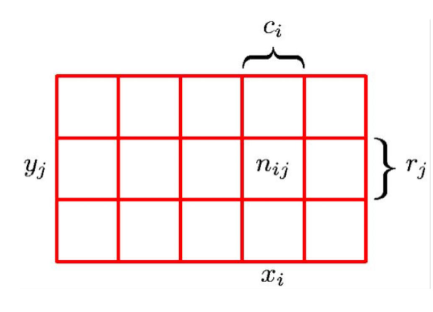

Here's an updated version with explanations and definitions:

# Probability Basics

* **Joint probability**: $P(X,Y) = P(Y|X)P(X)$
	+ Definition: The joint probability is the probability that two events X and Y occur together. It represents the likelihood of both events happening at the same time.
	+ Explanation: This equation states that the joint probability can be calculated by multiplying the conditional probability of event Y given event X $(P(Y|X))$ with the marginal probability of event X $(P(X))$.
* **Conditional probability**: $P(A|B) = P(B|A)P(A)/P(B)$
	+ Definition: The conditional probability is the probability that one event occurs given that another specific event has already occurred. It represents the likelihood of event A happening, given that events B have happened.
	+ Explanation: This equation states that the conditional probability can be calculated by multiplying the conditional probability of event B given event A $(P(B|A))$ with the marginal probability of event A $(P(A))$, and then dividing by the joint probability of both events $(P(B))$.
* **Marginal probability**: $P(X)$
	+ Definition: The marginal probability is the probability that an individual event occurs without considering any other events.
	+ Explanation: This represents the likelihood of a single event happening, independent of any other events.

## Examples

**Marginal Probability**
$$p(X = x_{i}) = \frac{c_{i}}{N}$$
**Joint Probability**
$$p(X=x_{i}, Y = y_{j}) = \frac{n_{ij}}{N}$$
**Conditional Probability**
$$p(Y=y_{j}|X=x_{i}) = \frac{n_{ij}}{c_{i}}$$
**Sum Rule**
$$p(X = x_{i}) = \frac{c_{i}}{N} = \frac{1}{N} \sum_{j = 1}^{L} n_{ij}$$
$$= \sum _{j=1}^{L} p (X = x_{i}, Y = y_{j})$$

**Product Rule**
$$p(X=x_{i}, Y = y_{j}) = \frac{n_{ij}}{N} = \frac{n_{ij}}{c_{i}} \dot{} \frac{c_{i}}{N}$$
$$= p(Y=y_{i}|X=x_{i})p(X=x_{i})$$

## Expectation
$$E[X] = \sum_{x}  x * p(x) $$

Expected outcome of a fair die?
$$(1+2+3+4+5+6) * \frac{1}{6} = 3.5$$

$$E[aX +b] = aE[X]+b$$
$$E[X + Y] = E[X]+E[Y]$$
$$(X \perp Y) \rightarrow E[X * Y] = E[X] * E[Y]$$

## Continuous Random Variables
𝑋 can take values on a continuous range, i.e., 𝑆 ⊂ ℝ
- E.g., height, weight
- Probability of 𝑋 falling into 𝑥, 𝑥 + 𝛿𝑥 : Pr{X ∈ 𝑥, 𝑥 + 𝛿𝑥 }
***![[Probability Density Function]]***
## Cumulative Distribution Function


# Naive Bayes Classifier

The Naive Bayes classifier assumes that each feature is **independent given the output class**, which means:

* $P(X_{2}|class=0,X_{1}=x_{1},x_{3}=x_{3}) = P(X_{2}|x_{1}=x_{3})$

This assumption allows us to simplify the calculation of conditional probabilities.

**Independence Violation**

In many real-world tasks, this assumption does not hold. For example, if we have a dataset with 3 features $(X1, X2, X3)$ and 2 classes:

* If the relationship between $X_{1}$ and $X_{2}$ given class=0 is correlated:
	+ $P(X2|class=0,X1=x1,x3=x3) ≠ P(X2|x1=x3)$

However, even if independence does not hold, Naïve Bayes classifiers can still provide good performance.

## Naive Bayes Algorithms

* **GaussianNB**: for continuous features
	+ Uses a Gaussian distribution to model the feature values.
	+ Example: `from sklearn.naive_bayes import GaussianNB` and `gnb = GaussianNB()`

```python
from sklearn.naive_bayes import GaussianNB
gnb = GaussianNB()
```
* **CategoricalNB**: for discrete features
	+ Uses an additive Laplace smoothing parameter (alpha) to model the feature values.
	+ Example: `from sklearn.naive_bayes import CategoricalNB` and `cnb = CategoricalNB(alpha=1.0)`

```python
from sklearn.naive_bayes import CategoricalNB
cnb = CategoricalNB(alpha=1.0)
```
**Important Equations and Data**

* **P(x|y)**: The conditional probability of event x given that event y has occurred.
	+ Definition: This represents the likelihood of an individual event occurring, given that another specific event has already happened.

 Example equation:
$P(X2|class=0,X1=x1,x3=x3) = P(Y=X2|X1=x1,x3=x3)*P(X1=x1,x3=x3)/P(class=0)$


* **E(X|Y=y)**: The expected value of event X given that event Y has occurred.
	+ Definition: This represents the average value of an individual feature, given that a specific class has already been observed.


Example equation:
$E((X-E(X|Y=y))^2 | Y=y) = Var(X|Y=y)$

* **Var(X|Y=y)**: The variance of event X given that event Y has occurred.
	+ Definition: This represents the variability or spread of an individual feature, given that a specific class has already been observed.


Example equation:
$E((X-E(X|Y=y))^2 | Y=y) = Var(X|Y=y)$

**Important Concepts**

* **MAP decision rule**: The maximum a posteriori (MAP) decision rule is the action that maximizes the posterior probability of choosing an action.
	+ Definition: This represents the optimal choice among multiple actions, given some prior knowledge about the problem.

* **Naïve Bayes classifier is an optimal Bayes classifier under certain assumptions**:
	+ Definition: Under the assumption of independence between features and classes, Naive Bayes classifiers are equivalent to full Bayesian methods.
